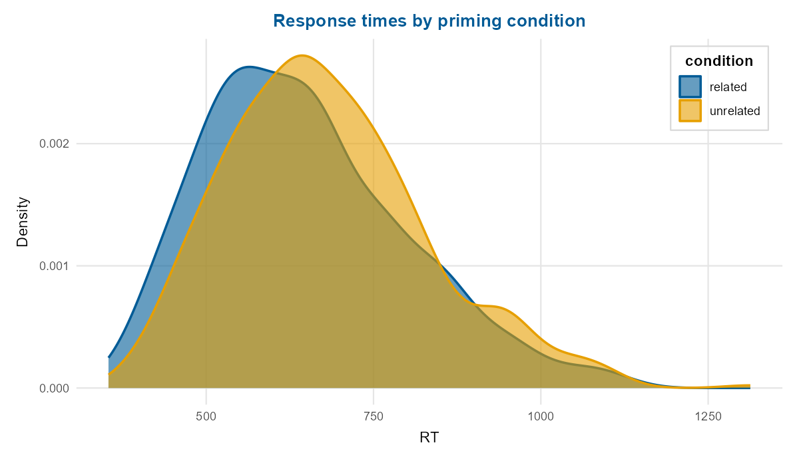
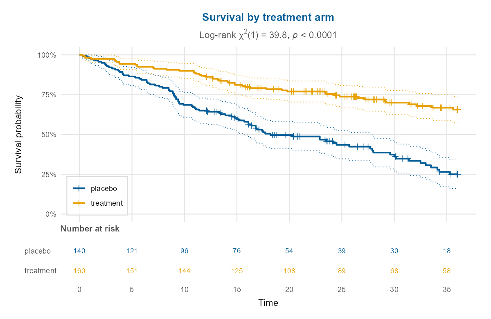

# depictr 

<!-- badges: start -->
[](https://github.com/pablobernabeu/depictr/actions/workflows/R-CMD-check.yaml)
[](https://lifecycle.r-lib.org/articles/stages.html#experimental)
[](https://opensource.org/license/MIT)
<!-- badges: end -->

**depictr** is a single, consistent toolkit of publication-ready plots that span
the whole analysis workflow, from a first look at the data, through model
estimates and predictions, to diagnostics, uncertainty and reporting. Most
packages address one part of this work; depictr aims to cover it from end to end
with *one* theme, *one* palette and *one* set of label conventions. Every
plotting function returns a [ggplot2](https://ggplot2.tidyverse.org) object (or a
[patchwork](https://patchwork.data-imaginist.com) for composite panels), so a
plot can be refined further with the usual `+` syntax.

A Python sibling, [depictr-py](https://github.com/pablobernabeu/depictr-py),
mirrors the same design.

## Gallery

A grouped density (the default palette is the colourblind-safe Okabe-Ito set) and
Kaplan-Meier survival curves with confidence bands and a number-at-risk table,
each from a single function call:





## Installation

```r
# install.packages("remotes")
remotes::install_github("pablobernabeu/depictr")
```

## What's in the box

**Explore data**: `explore_distribution()`, `ecdf_plot()`,
`explore_categorical()`, `explore_bivariate()`, `explore_pairs()`,
`correlation_heatmap()`, `missingness_map()`, `outlier_plot()`,
`raincloud_plot()`, `ridgeline_plot()`, `group_comparison_plot()`,
`estimation_plot()`, `dumbbell_plot()`, `scatter_trend()`, `summary_table()`.

**Multivariate, clustering & survival**: `pca_plot()`, `scree_plot()`,
`cluster_plot()`, `silhouette_plot()`, `k_diagnostic()`, `dendrogram_plot()`,
`survival_plot()`.

**Time series**: `timeseries_plot()`, `acf_plot()`, `decompose_plot()`,
`seasonal_plot()`, `ts_forecast()`.

**Model estimates & inference**: `tidy_estimates()`, `coefficient_plot()`,
`compare_models()`, `frequentist_bayesian_plot()`, `effects_plot()`,
`interaction_plot()`, `random_effects_plot()`, `optimizer_fixef_plot()`,
`model_fit_table()`.

**Diagnostics & classification**: `residual_diagnostics_plot()`,
`binned_residual_plot()`, `influence_plot()`, `qq_plot()`, `vif_plot()`,
`roc_curve_plot()`, `pr_curve_plot()`, `gain_plot()`, `lift_plot()`,
`calibration_plot()`, `threshold_plot()`, `confusion_matrix_plot()`.

**Uncertainty & power**: `posterior_plot()`, `power_curve_plot()`.

**Theming & reporting**: `theme_depictr()`, `depictr_palette()` /
`scale_colour_depictr()`, `palette_preview()`, `format_terms()`,
`model_report()`, `arrange_plots()`, `save_plot()`, `depictr_options()`.

Heavier modelling back-ends (`lme4`, `broom`, `simr`) are optional (in
`Suggests`) and used only when present; the core functions, examples, tests and
vignettes run on base `lm`/`glm` and the bundled data alone.

## A short tour

```r
library(depictr)

# Explore
explore_bivariate(crop_yield, fertiliser, yield)
correlation_heatmap(wellbeing_survey)

# Model
fit <- lm(yield ~ rainfall + fertiliser + soil_ph + treatment, data = crop_yield)
coefficient_plot(fit, order = "descending")
effects_plot(fit, "fertiliser")
interaction_plot(lm(yield ~ fertiliser * treatment, data = crop_yield),
                 "fertiliser", "treatment")

# Diagnose & classify
residual_diagnostics_plot(fit)
gfit <- glm(accuracy ~ word_frequency + RT, data = lexical_decision,
            family = binomial)
roc_curve_plot(gfit)

# Report
arrange_plots(qq_plot(fit), influence_plot(fit), ncol = 2, tag_levels = "A")
```

## Bundled data

Five reproducibly simulated datasets ship with the package and power every
example and vignette: `lexical_decision` (a counterbalanced psycholinguistic
experiment), `wellbeing_survey` (a survey with realistic missingness),
`crop_yield` (an agronomy field trial with a fertiliser-by-treatment
interaction), `clinical_trial` (right-censored survival times with a rare
adverse event) and `monthly_sales` (two seasonal retail series). They are
generated by [`data-raw/generate_datasets.R`](data-raw/generate_datasets.R) with
fixed seeds.

## Learn more

* `vignette("depictr")`: getting started
* `vignette("exploring-data")`: exploratory plots, estimation statistics and tables
* `vignette("model-estimates")`: estimates, comparison, predictions, random effects, and Bayesian posteriors
* `vignette("diagnostics-and-uncertainty")`: diagnostics, classification, posteriors, power
* `vignette("multivariate-and-survival")`: PCA, clustering with diagnostics, survival curves
* `vignette("time-series")`: trends, autocorrelation, decomposition, seasonality and forecasts

## How depictr relates to other packages

depictr aims for breadth and consistency across the workflow, and complements
the specialised packages rather than replacing them. For a deeper treatment of
any one area, several remain valuable, among them
[`ggstatsplot`](https://www.indrapatil.com/ggstatsplot/) (statistical
details on plots), [`sjPlot`](https://strengejacke.github.io/sjPlot/) and the
[easystats](https://easystats.github.io/easystats/) family (`see`, `parameters`,
`performance`), [`marginaleffects`](https://marginaleffects.com) /
[`ggeffects`](https://strengejacke.github.io/ggeffects/) (predictions),
[`GGally`](https://ggobi.github.io/ggally/) (pairs),
[`factoextra`](https://rpkgs.datanovia.com/factoextra/) (PCA and clustering),
[`survminer`](https://rpkgs.datanovia.com/survminer/) (survival),
[`feasts`](https://feasts.tidyverts.org) / `ggfortify` (time series),
[`ggdist`](https://mjskay.github.io/ggdist/) / `dabestr` (distributions and
estimation) and [`bayesplot`](https://mc-stan.org/bayesplot/) / `tidybayes`
(Bayesian). depictr offers a consistent and attractive default for all of these
tasks within a single package.

## Automated maintenance

depictr draws on a number of plotting and modelling packages, so several
scheduled GitHub Actions keep it healthy between releases:

* **`dependency-check`** runs **daily**, checking the package and its full test
  suite against both the current and the development versions of its
  dependencies, so a breaking change in any dependency is caught within a day.
  On failure it opens, and keeps updated, a single tracking issue.
* **`dependency-autofix`** runs whenever `dependency-check` fails: it asks Claude
  Code to find the smallest change that restores compatibility and to open a pull
  request, falling back to a comment on the tracking issue when no safe automated
  fix exists. It is inert until a `CLAUDE_CODE_OAUTH_TOKEN` secret is added to
  the repository — generate it with `claude setup-token` (it uses your Claude
  subscription, not billable API credits) and enable *Settings → Actions →
  General → Allow GitHub Actions to create and approve pull requests*.
* **`link-check`** runs weekly, validating every URL in the DESCRIPTION, README,
  help pages and vignettes with `urlchecker`, and opening a tracking issue if a
  link breaks or starts redirecting (both of which CRAN flags).
* **`R-CMD-check`** runs on every push and pull request across Linux, macOS and
  Windows (R release, development and previous release).

Each scheduled workflow can also be run on demand from the repository's
**Actions** tab.

## Citing depictr

`citation("depictr")` gives the preferred reference. The methods the package
implements are cited in the relevant help pages and vignettes, drawing on a
single bibliography at `inst/REFERENCES.bib`.

## License

MIT (c) Pablo Bernabeu. See [LICENSE.md](LICENSE.md).
