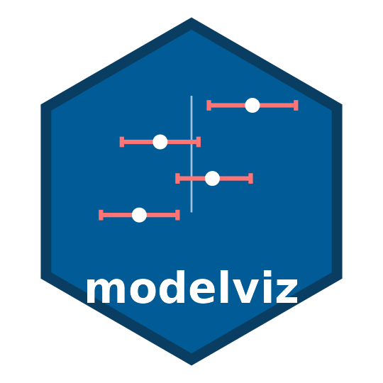
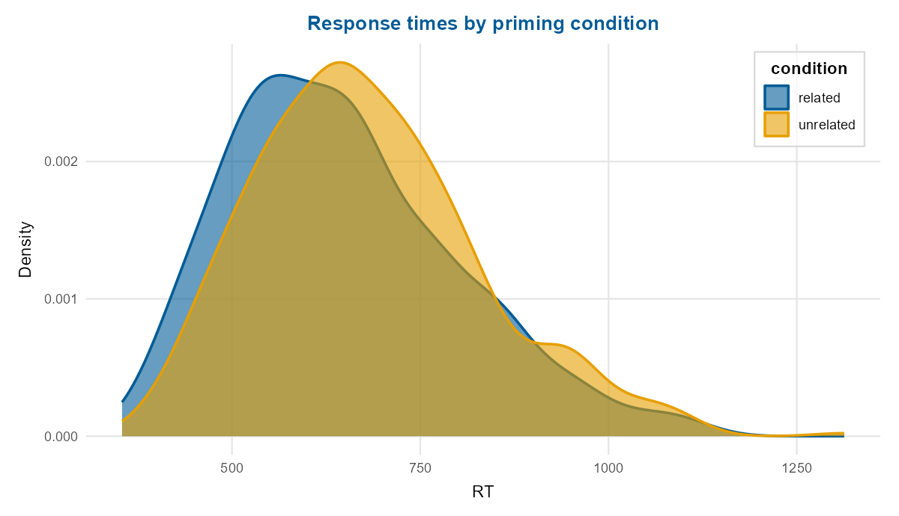
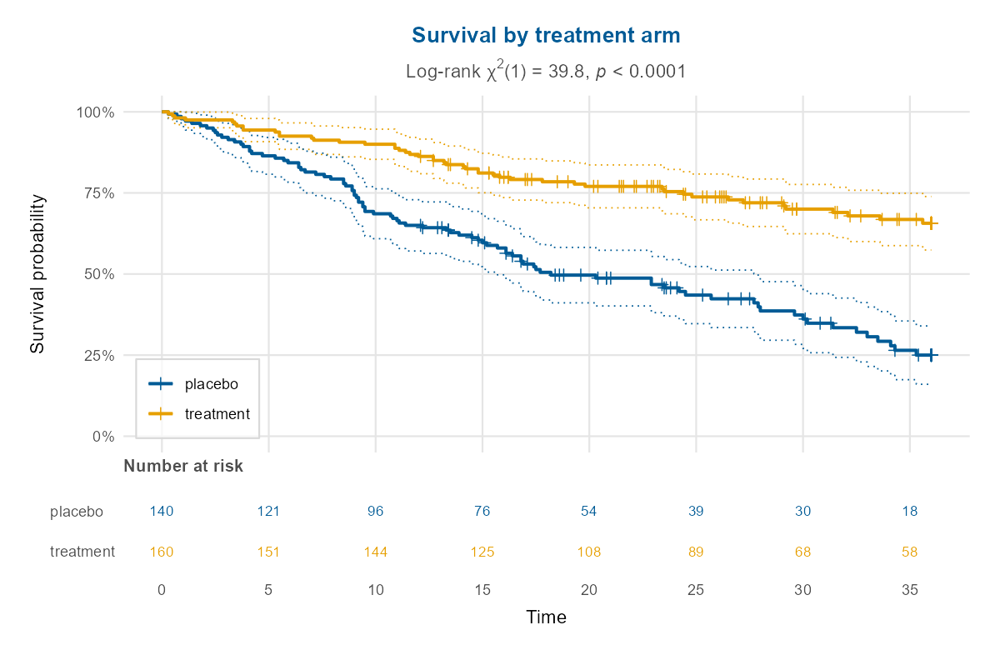

# depictr <small>(R)</small> 

<!-- badges: start -->
[](https://doi.org/10.5281/zenodo.21266308)
[](https://github.com/pablobernabeu/depictr/actions/workflows/R-CMD-check.yaml)
[](https://lifecycle.r-lib.org/articles/stages.html#experimental)
[](https://opensource.org/license/MIT)
<!-- badges: end -->

Documentation: <https://pablobernabeu.github.io/depictr/>

depictr is a single, consistent toolkit of publication-ready plots that span
the whole analysis workflow, from a first look at the data, through model
estimates and predictions, to diagnostics, uncertainty and reporting. Most
packages address one part of this work, whereas depictr aims to cover it from end
to end with one theme, one palette and one set of label conventions. Every
plotting function returns a [ggplot2](https://ggplot2.tidyverse.org) object (or a
[patchwork](https://patchwork.data-imaginist.com) for composite panels), so a
plot can be refined further with the usual `+` syntax.

This is the R half of a sibling pair. [The Python
package](https://pablobernabeu.github.io/depictr-py/) of the same name covers
most of the same workflow on top of [plotnine](https://plotnine.org); see its
README for the handful of functions that are not ported and the few places
where the two differ.

## Gallery

A grouped density (the default palette is a colourblind-safe set based on
Okabe-Ito) and
Kaplan-Meier survival curves with confidence bands and a number-at-risk table,
each from a single function call:





## Installation

```r
# install.packages("remotes")
remotes::install_github("pablobernabeu/depictr")
```

## What's in the box

The functions fall into seven families that follow the analysis workflow.
Exploratory plots and a descriptive summary table open it. The
model-estimate views come next (forest plots, model
comparison, predictions, interactions and random effects), then residual
diagnostics with the standard classification curves, and then posterior
summaries and power curves. Further families cover principal components,
clustering and survival, time series, and the shared theme with composition,
saving and reporting helpers. The
[reference](https://pablobernabeu.github.io/depictr/reference/index.html) lists
every function by family.

Heavier modelling back-ends (`lme4`, `broom`, `simr`) are optional (in
`Suggests`) and used only when present. The core functions, examples, tests and
vignettes run on base `lm`/`glm` and the bundled data alone.

## A first plot

```r
library(depictr)

fit <- lm(yield ~ rainfall + fertiliser + soil_ph + treatment, data = crop_yield)
coefficient_plot(fit, order = "descending")
```

The [Get started](https://pablobernabeu.github.io/depictr/articles/depictr.html)
article walks through the whole workflow, from exploration to diagnostics and
reporting.

## Bundled data

Five reproducibly simulated datasets (`lexical_decision`, `wellbeing_survey`,
`crop_yield`, `clinical_trial` and `monthly_sales`) ship with the package and
power every example and vignette. Each is documented under its own name and
described in the [Get started](https://pablobernabeu.github.io/depictr/articles/depictr.html)
article, and all are generated by
[`data-raw/generate_datasets.R`](https://github.com/pablobernabeu/depictr/blob/main/data-raw/generate_datasets.R)
with fixed seeds.

## Learn more

Each vignette takes one stretch of the workflow and works through it on the
bundled data.

* `vignette("depictr")`: getting started
* `vignette("exploring-data")`: exploratory plots, estimation statistics and tables
* `vignette("model-estimates")`: estimates, comparison, predictions, random effects and Bayesian posteriors
* `vignette("diagnostics-and-uncertainty")`: diagnostics, classification, posteriors, power
* `vignette("multivariate-and-survival")`: PCA, clustering with diagnostics, survival curves
* `vignette("time-series")`: trends, autocorrelation, decomposition, seasonality and forecasts

## How depictr relates to other packages

depictr aims for breadth and consistency across the workflow, and complements
the specialised packages rather than replacing them. For a deeper treatment of
any one area, several remain valuable, among them
[`ggstatsplot`](https://www.indrapatil.com/ggstatsplot/) (statistical
details on plots), [`sjPlot`](https://strengejacke.github.io/sjPlot/) and the
[easystats](https://easystats.github.io/easystats/) family (`see`, `parameters`,
`performance`), [`marginaleffects`](https://marginaleffects.com) /
[`ggeffects`](https://strengejacke.github.io/ggeffects/) (predictions),
[`GGally`](https://ggobi.github.io/ggally/) (pairs),
[`factoextra`](https://rpkgs.datanovia.com/factoextra/) (PCA and clustering),
[`survminer`](https://rpkgs.datanovia.com/survminer/) (survival),
[`feasts`](https://feasts.tidyverts.org) / `ggfortify` (time series),
[`ggdist`](https://mjskay.github.io/ggdist/) / `dabestr` (distributions and
estimation) and [`bayesplot`](https://mc-stan.org/bayesplot/) / `tidybayes`
(Bayesian). depictr offers one consistent default for all of these tasks within
a single package.

## Automated maintenance

depictr draws on a number of plotting and modelling packages, so scheduled
GitHub Actions keep it healthy between releases. A daily job checks the package
and its full test suite against both the current and the development versions of
its dependencies, and a weekly job checks every URL in the documentation. On top
of those, `R CMD check` runs on every push across Linux, macOS and Windows.

## Citation

`citation("depictr")` gives the preferred reference. The [About
page](https://pablobernabeu.github.io/depictr/articles/about.html) carries the
same citation with a BibTeX entry and a short note on the developer, and the
repository ships
[`CITATION.cff`](https://github.com/pablobernabeu/depictr/blob/main/CITATION.cff)
for the *Cite this repository* button on GitHub. The methods the package
implements are cited in the relevant help pages and vignettes, drawing on a
single bibliography at [`inst/REFERENCES.bib`](https://github.com/pablobernabeu/depictr/blob/main/inst/REFERENCES.bib).

## Licence

MIT (c) Pablo Bernabeu. See the
[licence](https://github.com/pablobernabeu/depictr/blob/main/LICENSE).

## Contributing

Issues and pull requests are welcome. The [contributing
guide](https://github.com/pablobernabeu/depictr/blob/main/.github/CONTRIBUTING.md)
describes the development setup and the conventions the package follows, and
everyone taking part is asked to honour the [Code of
Conduct](https://github.com/pablobernabeu/depictr/blob/main/.github/CODE_OF_CONDUCT.md).
