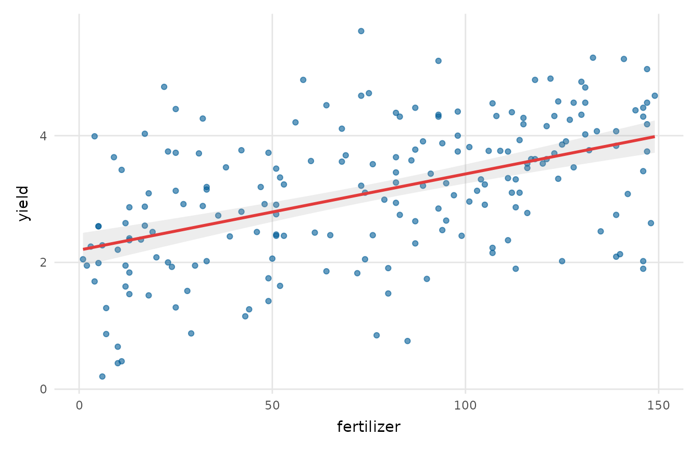
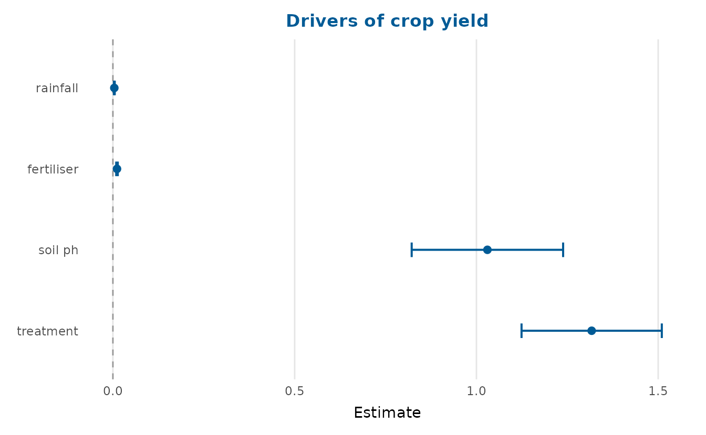
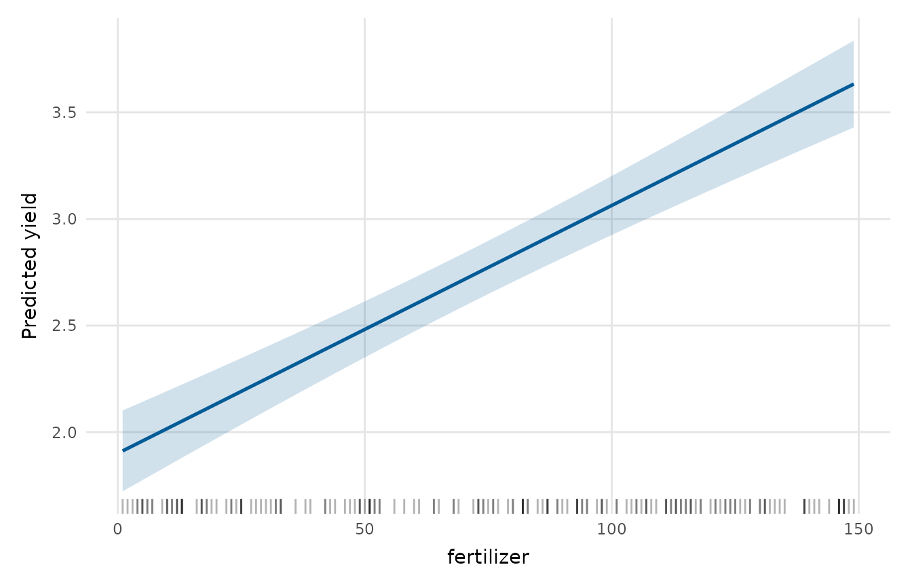
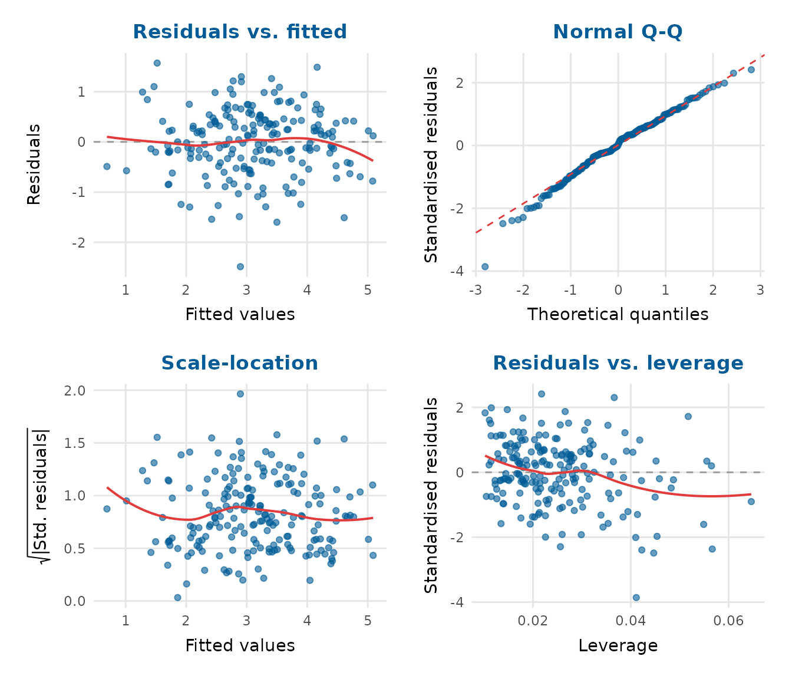
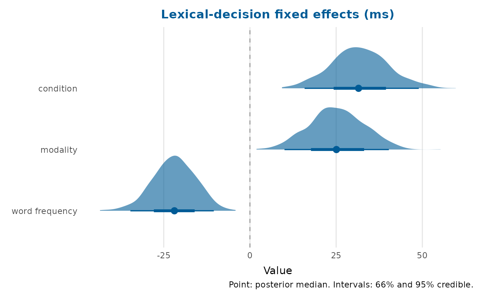
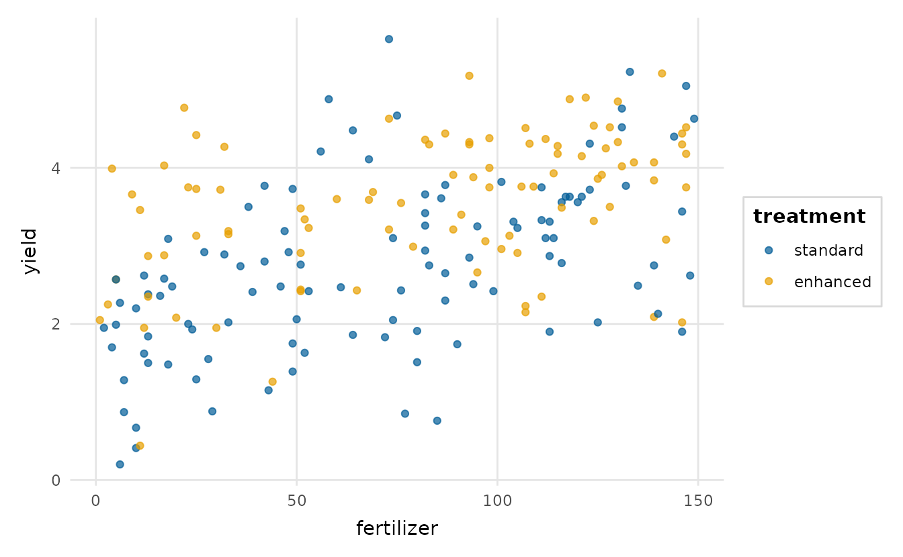
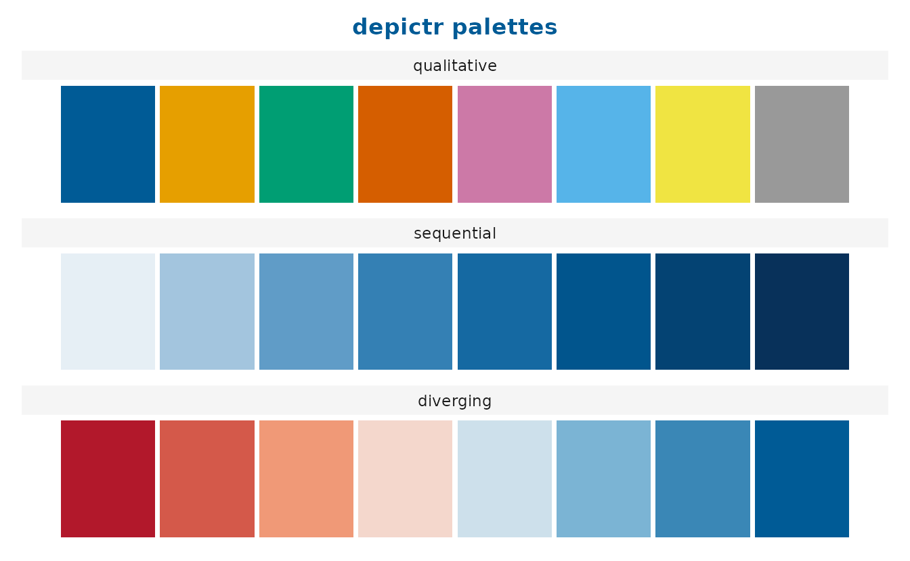

# Getting started with depictr

**depictr** is a single, consistent toolkit of plots that span the whole
analysis workflow, from a first look at the data, through model
estimates and predictions, to diagnostics, uncertainty and reporting.
Every plotting function returns a `ggplot2` object (or a `patchwork` for
composite panels), so you can keep customising with the usual `+`
syntax, and every plot shares one theme, one palette and one set of
label conventions.

``` r

library(depictr)
```

The package ships with three reproducibly simulated datasets used
throughout the documentation: `lexical_decision`, `wellbeing_survey` and
`crop_yield`.

## A tour by task

Begin with the data.
[`explore_bivariate()`](https://pablobernabeu.github.io/depictr/reference/explore_bivariate.md)
chooses a suitable plot for any pair of variables.

``` r

explore_bivariate(crop_yield, fertilizer, yield)
```



Turn next to the model. After fitting it,
[`coefficient_plot()`](https://pablobernabeu.github.io/depictr/reference/coefficient_plot.md)
draws a forest plot of the estimates.

``` r

fit <- lm(yield ~ rainfall + fertilizer + soil_ph + treatment, data = crop_yield)
coefficient_plot(fit, order = "descending", title = "Drivers of crop yield")
#> `height` was translated to `width`.
```



To see what the model implies,
[`effects_plot()`](https://pablobernabeu.github.io/depictr/reference/effects_plot.md)
traces the predicted response as one predictor varies.

``` r

effects_plot(fit, "fertilizer")
```



[`residual_diagnostics_plot()`](https://pablobernabeu.github.io/depictr/reference/residual_diagnostics_plot.md)
gathers the usual checks of the fit into one panel.

``` r

residual_diagnostics_plot(fit)
```



Finally,
[`posterior_plot()`](https://pablobernabeu.github.io/depictr/reference/posterior_plot.md)
summarises posterior or simulation draws as a point with nested
intervals.

``` r

set.seed(1)
draws <- data.frame(intercept = rnorm(2000, 2, 0.2),
                    fertilizer = rnorm(2000, 0.012, 0.002),
                    rainfall = rnorm(2000, 0.004, 0.001))
posterior_plot(draws)
```



## The shared spine: `tidy_estimates()`

Most of the model functions rest on
[`tidy_estimates()`](https://pablobernabeu.github.io/depictr/reference/tidy_estimates.md),
which turns a model, or a data frame of pre-computed estimates, into one
standard table. Because the plotting functions also accept that table,
estimates from any source (Bayesian posteriors, bootstrap intervals, or
figures taken from a paper) can be supplied directly.

``` r

tidy_estimates(fit)
#>                term     estimate    std.error     conf.low    conf.high
#> 1       (Intercept) -7.064270854 0.7031785868 -8.451082511 -5.677459196
#> 2          rainfall  0.003656021 0.0005798092  0.002512519  0.004799523
#> 3        fertilizer  0.011631807 0.0010495207  0.009561938  0.013701675
#> 4           soil_ph  1.094297128 0.1016434909  0.893835424  1.294758833
#> 5 treatmentenhanced  0.695586504 0.0941422178  0.509918841  0.881254167
```

## A consistent, accessible look

[`theme_depictr()`](https://pablobernabeu.github.io/depictr/reference/theme_depictr.md),
[`depictr_palette()`](https://pablobernabeu.github.io/depictr/reference/depictr_palette.md)
and
[`scale_colour_depictr()`](https://pablobernabeu.github.io/depictr/reference/scale_colour_depictr.md)
style your own plots too:

``` r

library(ggplot2)
ggplot(crop_yield, aes(fertilizer, yield, colour = treatment)) +
  geom_point(alpha = 0.7) +
  scale_colour_depictr() +
  theme_depictr()
```



The qualitative palette is based on the Okabe-Ito set, which stays
distinguishable under the common forms of colour-vision deficiency;
sequential and diverging variants are available too. Preview them with:

``` r

palette_preview(type = "all")
```



## Where to next

The remaining articles go into each area in turn.
[`vignette("exploring-data")`](https://pablobernabeu.github.io/depictr/articles/exploring-data.md)
covers distributions, categories, bivariate plots, scatter-plot
matrices, correlations, missingness, outliers and summary tables.
[`vignette("model-estimates")`](https://pablobernabeu.github.io/depictr/articles/model-estimates.md)
covers forest plots, model comparison, predicted values, interactions,
random effects and goodness-of-fit.
[`vignette("diagnostics-and-uncertainty")`](https://pablobernabeu.github.io/depictr/articles/diagnostics-and-uncertainty.md)
covers residuals, influence, Q-Q, ROC, calibration, confusion matrices,
posteriors and power curves. Two further articles,
[`vignette("multivariate-and-survival")`](https://pablobernabeu.github.io/depictr/articles/multivariate-and-survival.md)
and
[`vignette("time-series")`](https://pablobernabeu.github.io/depictr/articles/time-series.md),
cover the remaining methods.
