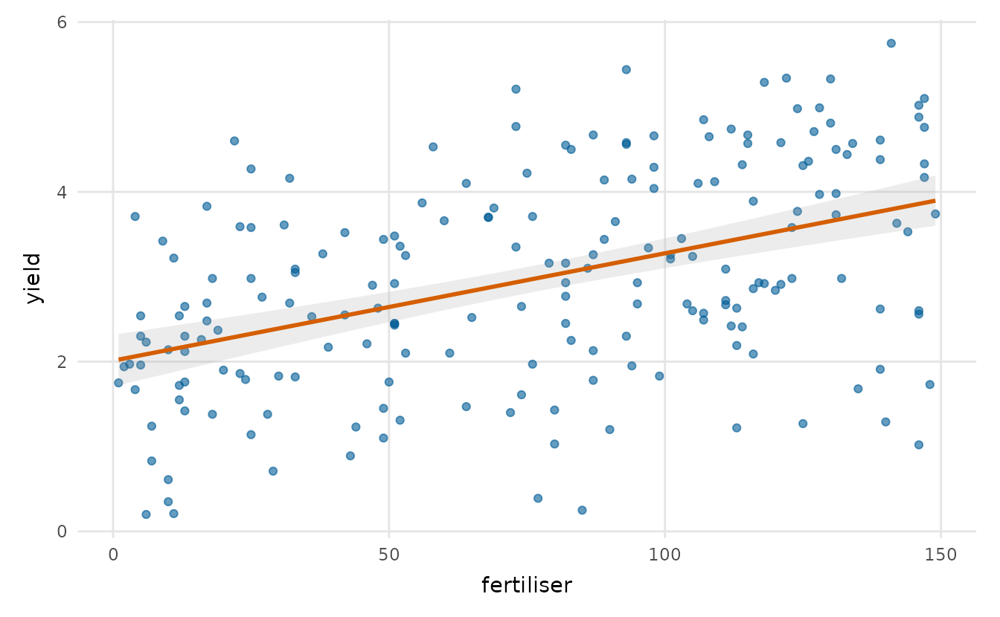
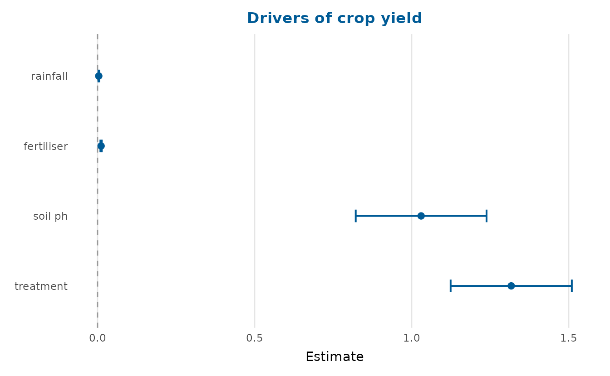
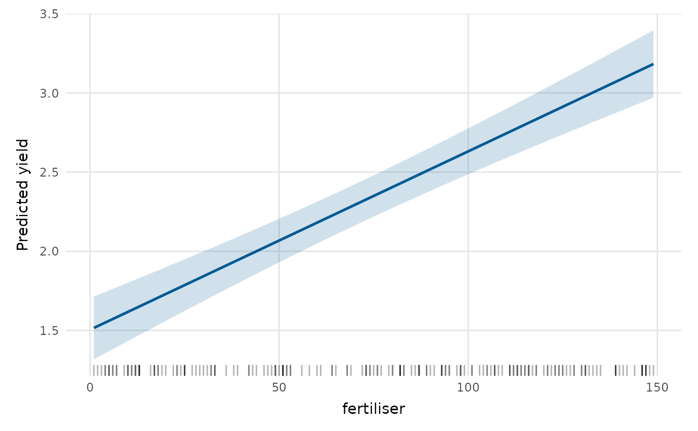
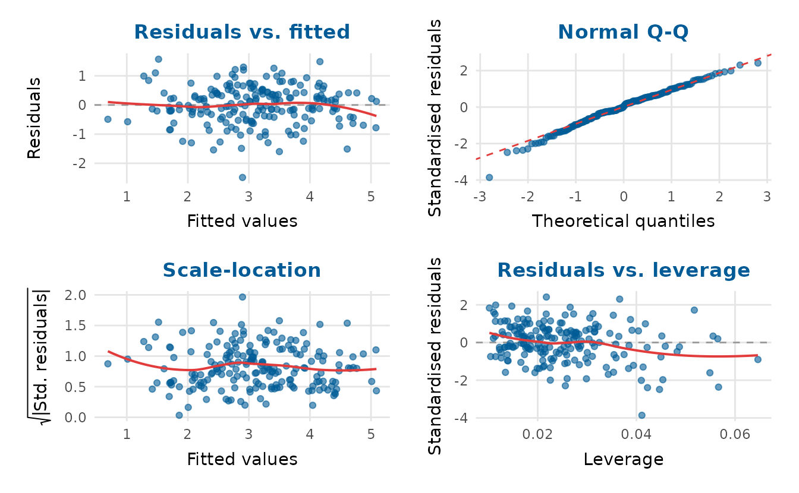
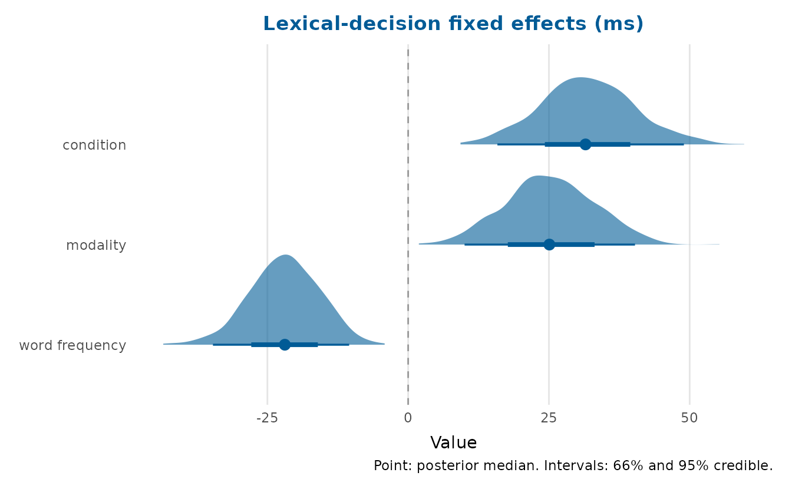
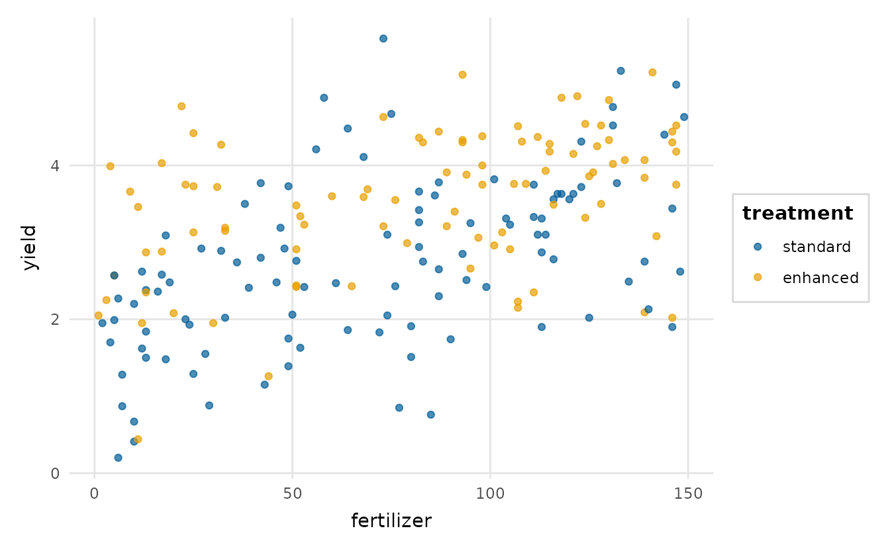
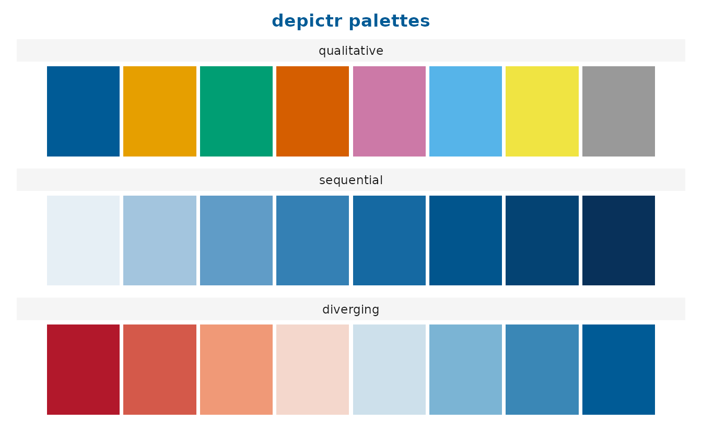
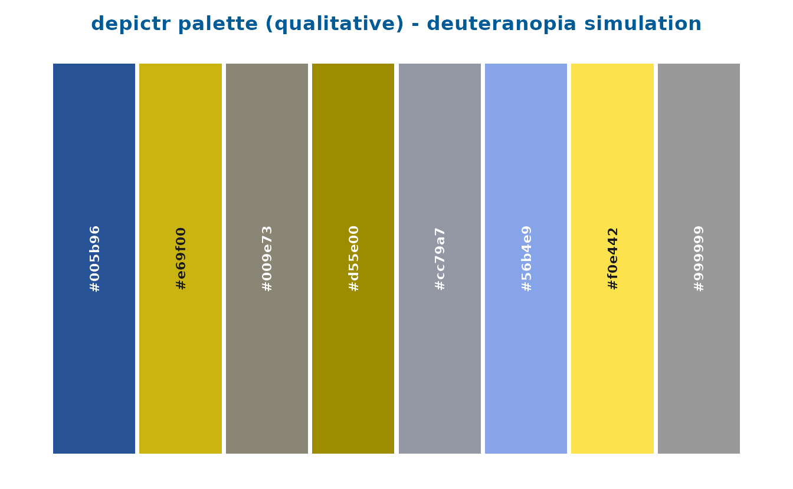
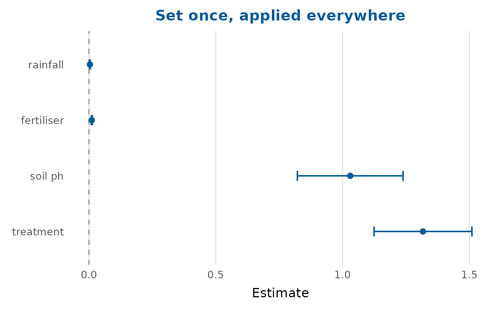

# Getting started with depictr

depictr is a single, consistent toolkit of plots that span the whole
analysis workflow, from a first look at the data, through model
estimates and predictions, to diagnostics, uncertainty and reporting.
Every plotting function returns a `ggplot2` object ([Wickham,
2016](#ref-wickham2016)) (or a `patchwork` for composite panels), so you
can keep customising with the usual `+` syntax, and every plot shares
one theme, one palette and one set of label conventions.

``` r

library(depictr)
```

## Five datasets to explore

The package ships with five reproducibly simulated datasets, each chosen
to exercise a different family of plots. They are documented under their
names
(e.g. [`?lexical_decision`](https://pablobernabeu.github.io/depictr/reference/lexical_decision.md))
and load with [`data()`](https://rdrr.io/r/utils/data.html):

- `lexical_decision`: a counterbalanced, crossed reaction-time/accuracy
  experiment (participant, item, condition, modality, word frequency).
  For mixed models and the classification plots.
- `wellbeing_survey`: a cross-sectional survey (life satisfaction,
  stress, sleep, income, age, ordered education, region) with
  *informative* missingness. For descriptives, correlations, regression
  and missing data.
- `crop_yield`: a field trial with a genuine fertiliser-by-treatment
  interaction. For regression, scatter-trend and interaction plots.
- `clinical_trial`: a two-arm trial with separating survival curves and
  a rare adverse-event outcome. For survival and imbalanced
  classification.
- `monthly_sales`: two seasonal monthly series (indoor/outdoor). For the
  time-series plots.

## A tour by task

Begin with the data.
[`explore_bivariate()`](https://pablobernabeu.github.io/depictr/reference/explore_bivariate.md)
chooses a suitable plot for any pair of variables, here a scatter with a
trend because both are numeric.

``` r

explore_bivariate(crop_yield, fertiliser, yield)
```



Turn next to the model. After fitting it,
[`coefficient_plot()`](https://pablobernabeu.github.io/depictr/reference/coefficient_plot.md)
draws a forest plot of the estimates.

``` r

fit <- lm(yield ~ rainfall + fertiliser + soil_ph + treatment,
          data = crop_yield)
coefficient_plot(fit, order = "descending", title = "Drivers of crop yield")
```



To see what the model implies,
[`effects_plot()`](https://pablobernabeu.github.io/depictr/reference/effects_plot.md)
traces the predicted response as one predictor varies.

``` r

effects_plot(fit, "fertiliser")
```



[`residual_diagnostics_plot()`](https://pablobernabeu.github.io/depictr/reference/residual_diagnostics_plot.md)
gathers the usual checks of the fit into one panel.

``` r

residual_diagnostics_plot(fit)
```



For uncertainty,
[`posterior_plot()`](https://pablobernabeu.github.io/depictr/reference/posterior_plot.md)
summarises posterior or simulation draws as a distribution per
parameter. These are the fixed-effect posterior draws from a Bayesian
fit of the lexical-decision model, shipped with the package.

``` r

draws <- readRDS(system.file("extdata", "lexdec_draws.rds",
                             package = "depictr"))
posterior_plot(draws[c("conditionunrelated", "modalityauditory",
                       "word_frequency")],
               labels = c(conditionunrelated = "condition",
                          modalityauditory = "modality",
                          word_frequency = "word frequency"),
               title = "Lexical-decision fixed effects (ms)")
```



## The shared spine: `tidy_estimates()`

Most of the model functions rest on
[`tidy_estimates()`](https://pablobernabeu.github.io/depictr/reference/tidy_estimates.md),
which turns a model, or a data frame of pre-computed estimates, into one
standard table. Because the plotting functions also accept that table,
estimates from any source (Bayesian posteriors, bootstrap intervals, or
figures taken from a paper) can be supplied directly.

``` r

tidy_estimates(fit)
```

                   term     estimate    std.error     conf.low    conf.high
    1       (Intercept) -7.156372471 0.7307020339 -8.597465983 -5.715278960
    2          rainfall  0.003869765 0.0006025038  0.002681505  0.005058026
    3        fertiliser  0.011266582 0.0010906005  0.009115695  0.013417469
    4           soil_ph  1.030217728 0.1056219670  0.821909657  1.238525800
    5 treatmentenhanced  1.317044684 0.0978270830  1.124109715  1.509979654

## A consistent, accessible look

[`theme_depictr()`](https://pablobernabeu.github.io/depictr/reference/theme_depictr.md),
[`depictr_palette()`](https://pablobernabeu.github.io/depictr/reference/depictr_palette.md)
and
[`scale_colour_depictr()`](https://pablobernabeu.github.io/depictr/reference/scale_colour_depictr.md)
style your own plots too:

``` r

library(ggplot2)
ggplot(crop_yield, aes(fertiliser, yield, colour = treatment)) +
  geom_point(alpha = 0.7) +
  scale_colour_depictr() +
  theme_depictr()
```



[`depictr_palette()`](https://pablobernabeu.github.io/depictr/reference/depictr_palette.md)
returns the underlying hex colours directly, ready to feed
[`scale_fill_manual()`](https://ggplot2.tidyverse.org/reference/scale_manual.html)
or a base-graphics `col =` argument:

``` r

depictr_palette(4)
```

    [1] "#005b96" "#e69f00" "#009e73" "#d55e00"

The qualitative palette is based on the Okabe-Ito set ([Okabe & Ito,
2008](#ref-okabe2008)), which stays distinguishable under the common
forms of colour-vision deficiency, and sequential and diverging variants
are available too. Preview them with:

``` r

palette_preview(type = "all")
```



[`palette_preview()`](https://pablobernabeu.github.io/depictr/reference/palette_preview.md)
can also *simulate* a colour-vision deficiency, so you can check a
palette as a deuteranope (red-green) would see it:

``` r

palette_preview(cvd = "deutan")
```



The simulation is available on its own as
[`simulate_cvd()`](https://pablobernabeu.github.io/depictr/reference/simulate_cvd.md),
and
[`palette_safety()`](https://pablobernabeu.github.io/depictr/reference/palette_safety.md)
turns it into a verdict: for normal vision and each deficiency at full
severity it reports the smallest perceptual distance between any two
colours in a palette, so the accessibility claim comes with a number
attached.

``` r

palette_safety()
```

    $min_delta_e
    [1] 7.4

    $by_condition
    normal protan deutan tritan 
     33.43  18.15   7.40  16.18 

    $worst_condition
    [1] "deutan"

    $worst_pair
    [1] "#cc79a7" "#999999"

    $safe
    [1] TRUE

    $threshold
    [1] 5

## Auditing the figure you are about to submit

A safe palette is not a safe figure. Once a plot has been extended with
your own scale, shrunk to fit a journal column, or asked to distinguish
groups by colour alone, the palette’s guarantee no longer describes what
a reader will see.
[`check_figure()`](https://pablobernabeu.github.io/depictr/reference/check_figure.md)
reads a built plot and reports what it measured, next to the threshold
it was measured against, so each verdict can be argued with.

``` r

grouped <- ggplot(crop_yield, aes(fertiliser, yield, colour = treatment)) +
  geom_point(alpha = 0.7) +
  scale_colour_depictr() +
  theme_depictr()

check_figure(grouped)
```

                           check measured threshold verdict
    1        colour_separability   119.21       5.0    pass
    2 colour_separability_protan   108.92       5.0    pass
    3 colour_separability_deutan   121.29       5.0    pass
    4 colour_separability_tritan    77.90       5.0    pass
    5     greyscale_separability    33.34       5.0    pass
    6                  text_size     8.80       6.0    pass
    7              text_contrast     8.45       4.5    pass
    8          geometry_contrast     2.25       3.0    fail
    9         redundant_encoding     0.00       1.0    fail
                                                                 detail
    1           Closest pair #005b96 and #e69f00 of 2 encoding colours.
    2           Closest pair #005b96 and #e69f00 of 2 encoding colours.
    3           Closest pair #005b96 and #e69f00 of 2 encoding colours.
    4           Closest pair #005b96 and #e69f00 of 2 encoding colours.
    5                Closest pair #005b96 and #e69f00 in CIE lightness.
    6 Smallest text 8.80 pt, drawn at 17.78 cm and printed at 17.78 cm.
    7                          Lowest-contrast text #4d4d4d on #ffffff.
    8                        Lowest-contrast colour #e69f00 on #ffffff.
    9                            Colour alone distinguishes the groups.

Two rows are worth dwelling on. `geometry_contrast` measures each
encoding colour against the panel background, and the palette’s orange
sits at 2.25 against white, below the 3:1 that WCAG asks of a graphical
object ([World Wide Web Consortium, 2023](#ref-wcag22)).
`redundant_encoding` is zero because nothing but colour tells the two
treatments apart. Mapping shape as well, and letting the darker
vermillion do the second colour’s work, clears both:

``` r

mended <- ggplot(crop_yield, aes(fertiliser, yield, colour = treatment,
                                 shape = treatment)) +
  geom_point(alpha = 0.7) +
  scale_colour_manual(values = c("#005b96", "#d55e00")) +
  theme_depictr()

check_figure(mended)[, c("check", "measured", "threshold", "verdict")]
```

                           check measured threshold verdict
    1        colour_separability   111.87       5.0    pass
    2 colour_separability_protan    89.87       5.0    pass
    3 colour_separability_deutan   107.07       5.0    pass
    4 colour_separability_tritan    98.50       5.0    pass
    5     greyscale_separability    16.92       5.0    pass
    6                  text_size     8.80       6.0    pass
    7              text_contrast     8.45       4.5    pass
    8          geometry_contrast     3.87       3.0    pass
    9         redundant_encoding     1.00       1.0    pass

The audit also takes a stated output width, which is where most figure
text quietly fails. Text is drawn in points, so a figure saved seven
inches wide and then printed in an 8.9 cm column arrives at half the
size it looked on screen:

``` r

subset(check_figure(grouped, width_cm = 8.9), check == "text_size")
```

          check measured threshold verdict
    6 text_size      4.4         6    fail
                                                                detail
    6 Smallest text 8.80 pt, drawn at 17.78 cm and printed at 8.90 cm.

One limitation belongs here, beside the claim it qualifies, since the
package is the one making that claim. The eight-colour qualitative
palette clears every colour-vision check and fails the greyscale check:
its orange and its sky blue differ by 0.79 in CIE lightness, so a
black-and-white printer renders them as the same grey. The Okabe-Ito
guarantee is about hue confusion and was never a claim about greyscale.
The threshold stays where it is, the check reports the number, and the
claim has been narrowed to match. A figure that may be printed in black
and white wants fewer groups, a sequential palette, or a redundant shape
or line type.

``` r

eight <- data.frame(g = factor(letters[1:8]), x = 1:8, y = 1:8)
p8 <- ggplot(eight, aes(x, y, colour = g)) +
  geom_point() +
  scale_colour_depictr() +
  theme_depictr()

subset(check_figure(p8), check == "greyscale_separability")
```

                       check measured threshold verdict
    5 greyscale_separability     0.79         5    fail
                                                  detail
    5 Closest pair #56b4e9 and #e69f00 in CIE lightness.

Set the look once for a whole script with
[`depictr_options()`](https://pablobernabeu.github.io/depictr/reference/depictr_options.md).
It carries the base size and family, the brand and accent colours and a
custom palette, so the same arguments need not travel with every call.
Called with no arguments it reports the current settings:

``` r

depictr_options()
```

    $base_size
    [1] 11

    $base_family
    [1] ""

    $brand
    [1] "#005b96"

    $accent
    [1] "#d55e00"

    $reference
    [1] "grey60"

    $palette
    NULL

    $na_value
    [1] "grey80"

Supplying arguments sets them for every later plot and returns the
previous values, so you can put the look back afterwards:

``` r

old <- depictr_options(base_size = 13, accent = "#b3589a")
coefficient_plot(fit, title = "Set once, applied everywhere")
```



``` r

do.call(depictr_options, old)   # restore the previous settings
```

## Where to next

The remaining articles go into each area in turn.
[`vignette("exploring-data")`](https://pablobernabeu.github.io/depictr/articles/exploring-data.md)
covers distributions, categories, bivariate plots, scatter-plot
matrices, correlations, missingness, outliers, summary tables and the
estimation plots.
[`vignette("model-estimates")`](https://pablobernabeu.github.io/depictr/articles/model-estimates.md)
is the flagship: forest plots, model comparison, predicted values,
interactions, random effects, optimiser checks and the
frequentist-over-Bayesian-posterior overlay.
[`vignette("diagnostics-and-uncertainty")`](https://pablobernabeu.github.io/depictr/articles/diagnostics-and-uncertainty.md)
covers residuals, GLM-appropriate binned residuals, the classification
suite (ROC, PR, gains, lift, calibration, thresholds) on an imbalanced
outcome, and power curves. Two further articles,
[`vignette("multivariate-and-survival")`](https://pablobernabeu.github.io/depictr/articles/multivariate-and-survival.md)
and
[`vignette("time-series")`](https://pablobernabeu.github.io/depictr/articles/time-series.md),
cover the remaining methods.

## References

Okabe, M., & Ito, K. (2008). *Color Universal Design (CUD): How to make
figures and presentations that are friendly to colorblind people*.
<https://jfly.uni-koeln.de/color/>.

Wickham, H. (2016). *ggplot2: Elegant graphics for data analysis* (2nd
ed.). Springer. <https://doi.org/10.1007/978-3-319-24277-4>

World Wide Web Consortium. (2023). *Web Content Accessibility Guidelines
(WCAG) 2.2*. W3C Recommendation, <https://www.w3.org/TR/WCAG22/>.
