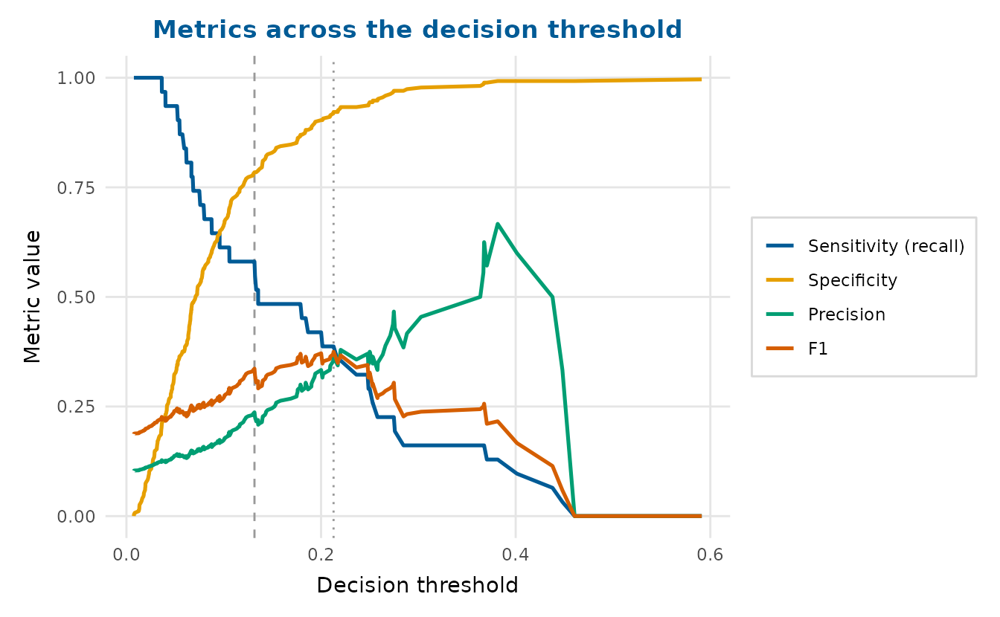
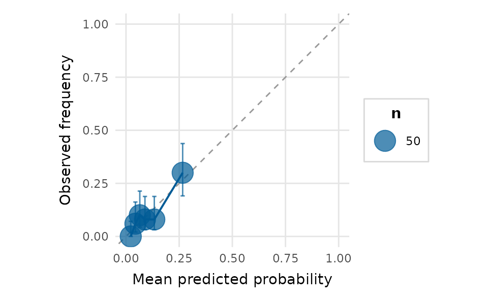
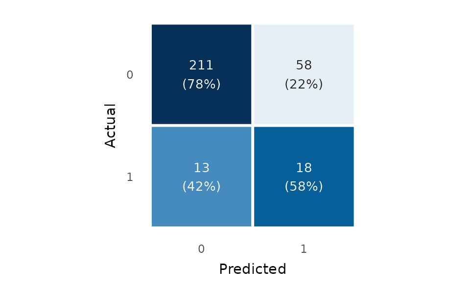
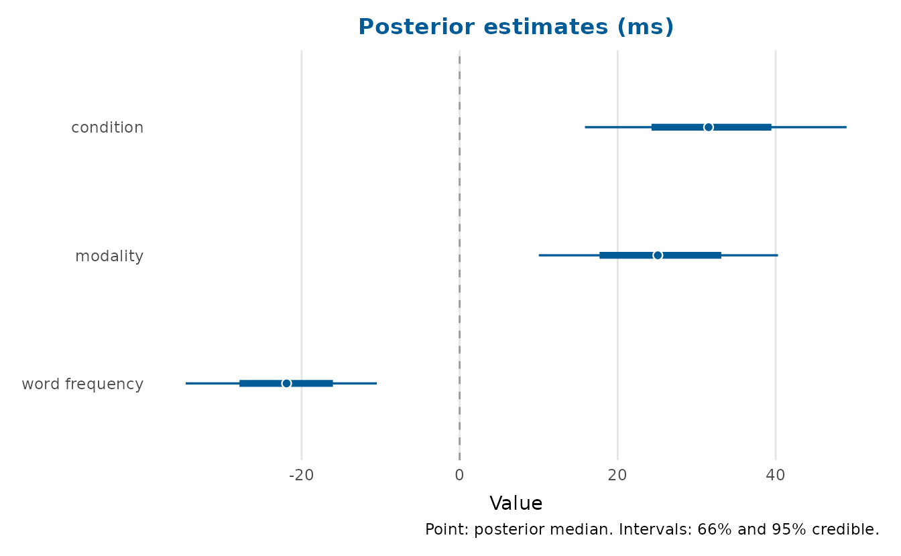
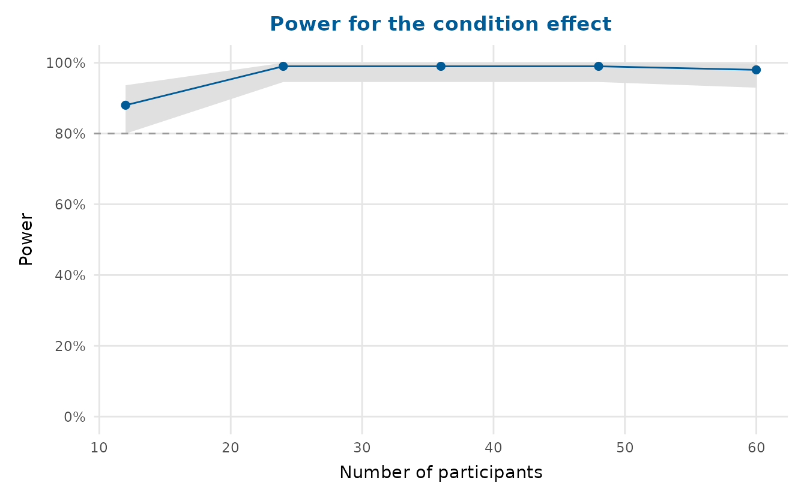
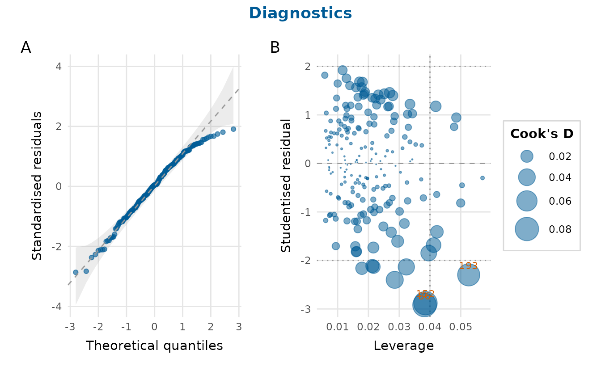

# Diagnostics, classification and uncertainty

## Regression diagnostics

[`residual_diagnostics_plot()`](https://pablobernabeu.github.io/depictr/reference/residual_diagnostics_plot.md)
assembles the classic panel;
[`influence_plot()`](https://pablobernabeu.github.io/depictr/reference/influence_plot.md)
and
[`qq_plot()`](https://pablobernabeu.github.io/depictr/reference/qq_plot.md)
zoom in on particular checks. We fit a linear model to the crop-yield
trial.

``` r

fit <- lm(yield ~ rainfall + fertiliser + soil_ph, data = crop_yield)
```

``` r

residual_diagnostics_plot(fit, title = "Crop-yield model")
```


``` r

influence_plot(fit)
```


The bubble area is Cook’s distance, the standard measure of an
observation’s influence on the fitted coefficients ([Cook,
1977](#ref-cook1977)).

[`vif_plot()`](https://pablobernabeu.github.io/depictr/reference/vif_plot.md)
checks for multicollinearity among the predictors:

``` r

vif_plot(fit)
```


## Diagnostics for a generalised linear model

For a binary `glm` the raw residuals take only a few values, so a plain
residual-versus-fitted plot is hard to read.
[`binned_residual_plot()`](https://pablobernabeu.github.io/depictr/reference/binned_residual_plot.md)
instead splits the data into equal-count bins of fitted values and plots
the mean residual per bin against a +/- 2 standard-error band ([Gelman &
Hill, 2007](#ref-gelman2007)): most points should sit inside the band,
scattered around zero.

We model the *rare* adverse-event outcome from the clinical trial (about
a 10% base rate) on the baseline biomarker, age and treatment arm.

``` r

gfit <- glm(adverse_event ~ biomarker + age + arm,
            data = clinical_trial, family = binomial)
```

``` r

binned_residual_plot(gfit, title = "Binned residuals: adverse-event model")
```


[`residual_diagnostics_plot()`](https://pablobernabeu.github.io/depictr/reference/residual_diagnostics_plot.md)
recognises a `glm` and switches to GLM-appropriate panels (binned
residuals and a Q-Q plot of randomized quantile residuals, which are
standard-normal under a correct model regardless of the response
distribution):

``` r

residual_diagnostics_plot(gfit, title = "Adverse-event model")
```


## Classification on a genuinely imbalanced outcome

The adverse-event outcome is imbalanced, which is exactly when the
precision-recall, gains and lift charts earn their keep. depictr’s
classification plots each read a binomial `glm` directly, a pair of
vectors, or – to *compare several models* – a **named list** of models.

The ROC curve reports the AUC. Passing `youden = TRUE` marks the
Youden’s J operating point (the threshold maximising sensitivity +
specificity - 1):

``` r

roc_curve_plot(gfit, youden = TRUE)
```


When the positive class is rare the precision-recall curve is more
informative than the ROC curve, because it ignores the many true
negatives. The baseline is the positive prevalence; `f1 = TRUE` marks
the maximum-F1 operating point:

``` r

pr_curve_plot(gfit, f1 = TRUE)
```


### Comparing two models in one figure

A *named list* overlays one colour-coded curve per model, with a
per-curve AUC (or average precision) in the legend. Here the full model
is compared with a biomarker-only model.

``` r

reduced <- glm(adverse_event ~ biomarker, data = clinical_trial,
               family = binomial)
models <- list(Full = gfit, `Biomarker only` = reduced)
```

Because an ROC curve hugs the top-left, the bottom-right corner is
always free, so `legend_inside = TRUE` tucks the per-model legend there
and reclaims the right-hand margin:

``` r

roc_curve_plot(models, youden = TRUE, legend_inside = TRUE)
```


``` r

pr_curve_plot(models, f1 = TRUE)
```


For ranking and targeting tasks, the cumulative gains and lift charts
show how many positive cases are captured as more of the score-ordered
population is targeted – again overlaying both models:

``` r

gain_plot(models, legend_inside = TRUE)
```


``` r

lift_plot(models, legend_inside = TRUE)
```


### Choosing an operating point

[`threshold_plot()`](https://pablobernabeu.github.io/depictr/reference/threshold_plot.md)
sweeps the decision threshold across the full range of scores and plots
each metric as it trades off, marking the Youden and maximum-F1 optimal
thresholds with dashed lines. It is the natural companion to the ROC and
PR curves for actually *choosing* a cut-off.

``` r

tp <- threshold_plot(gfit, title = "Metrics across the decision threshold")
tp
```



``` r

attr(tp, "thresholds")   # the Youden and max-F1 thresholds
#>    youden        f1 
#> 0.1315540 0.2128417
```

### Calibration

[`calibration_plot()`](https://pablobernabeu.github.io/depictr/reference/calibration_plot.md)
checks whether predicted probabilities match observed frequencies. Each
bin’s observed rate carries a Wilson binomial confidence interval, so
bins backed by few observations – common in the sparse upper tail when
the outcome is rare – are not over-interpreted.

``` r

calibration_plot(gfit, bins = 6)
```



A confusion-matrix heatmap completes the picture. Passing
`threshold = "youden"` reuses the same operating point the ROC curve
marks, so the two agree:

``` r

confusion_matrix_plot(gfit, threshold = "youden", normalise = "row")
```



## Uncertainty

[`posterior_plot()`](https://pablobernabeu.github.io/depictr/reference/posterior_plot.md)
summarises draws (posterior, bootstrap, simulation) as a distribution
per parameter. Here are the real posterior draws from a Bayesian fit of
the lexical-decision model, shown as point-and-interval forests.

``` r

draws <- readRDS(system.file("extdata", "lexdec_draws.rds", package = "depictr"))
posterior_plot(draws[c("conditionunrelated", "modalityauditory",
                       "word_frequency")],
               labels = c(conditionunrelated = "condition",
                          modalityauditory = "modality",
                          word_frequency = "word frequency"),
               style = "interval", title = "Posterior estimates (ms)")
```



## Power curves

[`power_curve_plot()`](https://pablobernabeu.github.io/depictr/reference/power_curve_plot.md)
reads a
[`simr::powerCurve()`](https://rdrr.io/pkg/simr/man/powerCurve.html)
object or a tidy data frame, so a slow power simulation does not have to
be re-run to redraw it. The package ships a real `powerCurve` object
from a `simr` analysis of the lexical-decision design (power for the
condition effect across numbers of participants); we read it straight
from disk.

``` r

pc <- readRDS(system.file("extdata", "powercurve_lexdec.rds", package = "depictr"))
power_curve_plot(pc, x_lab = "Number of participants",
                 title = "Power for the condition effect")
```



``` r

power_curve_plot(pc_df, x_lab = "Number of participants",
                 title = "Power for the condition effect")
```

## Composing and saving

Combine any of these with
[`arrange_plots()`](https://pablobernabeu.github.io/depictr/reference/arrange_plots.md)
and save with
[`save_plot()`](https://pablobernabeu.github.io/depictr/reference/save_plot.md):

``` r

arrange_plots(
  qq_plot(fit), influence_plot(fit),
  ncol = 2, title = "Diagnostics", tag_levels = "A"
)
```



## References

Cook, R. D. (1977). Detection of influential observation in linear
regression. *Technometrics*, *19*(1), 15–18.
<https://doi.org/10.1080/00401706.1977.10489493>

Gelman, A., & Hill, J. (2007). *Data analysis using regression and
multilevel/hierarchical models*. Cambridge University Press.
<https://doi.org/10.1017/CBO9780511790942>
