# Diagnostics, classification and uncertainty

## Regression diagnostics

[`residual_diagnostics_plot()`](https://pablobernabeu.github.io/depictr/reference/residual_diagnostics_plot.md)
assembles the classic panel;
[`influence_plot()`](https://pablobernabeu.github.io/depictr/reference/influence_plot.md)
and
[`qq_plot()`](https://pablobernabeu.github.io/depictr/reference/qq_plot.md)
zoom in on particular checks.

``` r

fit <- lm(yield ~ rainfall + fertilizer + soil_ph, data = crop_yield)
```

``` r

residual_diagnostics_plot(fit, title = "Crop-yield model")
```

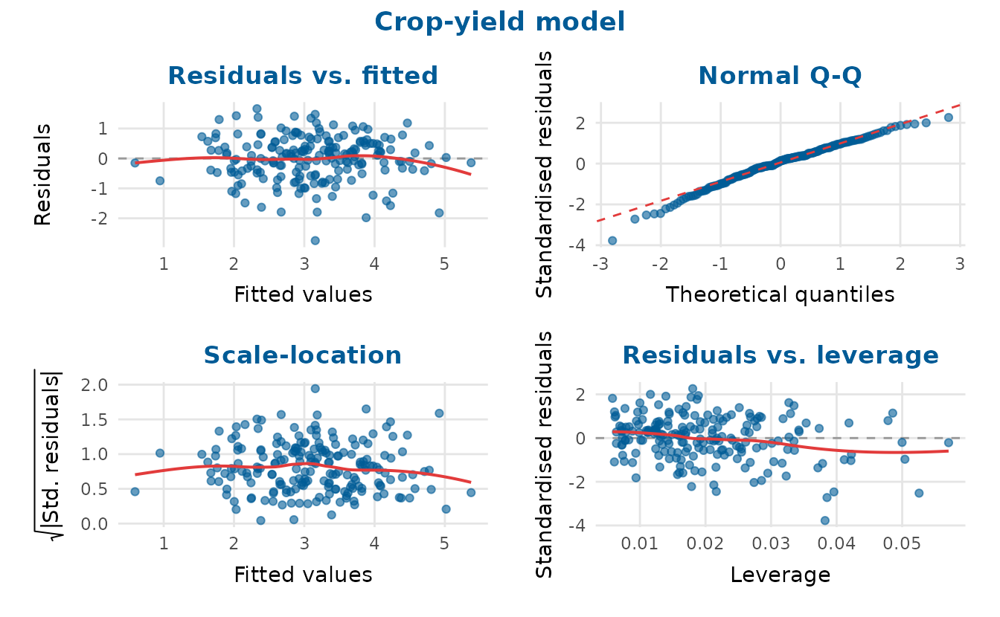

``` r

influence_plot(fit)
```

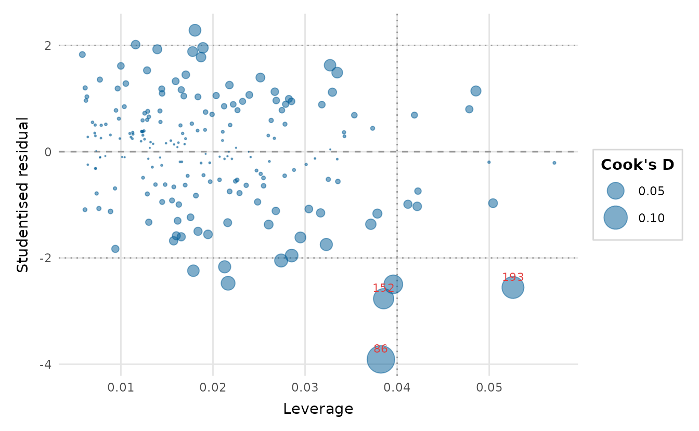

The bubble area is Cook’s distance, the standard measure of an
observation’s influence on the fitted coefficients ([Cook,
1977](#ref-cook1977)).

[`vif_plot()`](https://pablobernabeu.github.io/depictr/reference/vif_plot.md)
checks for multicollinearity among the predictors:

``` r

vif_plot(fit)
```

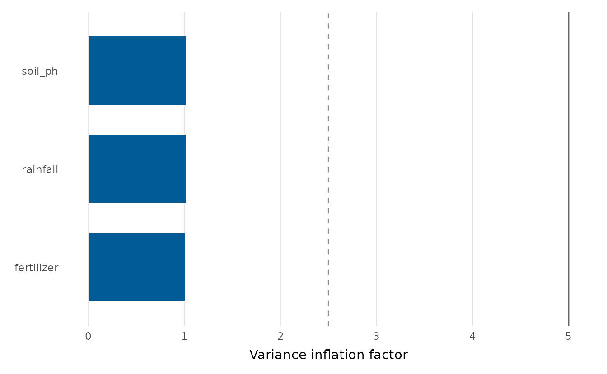

## Classification

For binary classifiers, depictr provides an ROC curve (with AUC), a
calibration plot and a confusion-matrix heatmap. Each reads a binomial
`glm` directly, or a pair of vectors.

``` r

gfit <- glm(accuracy ~ word_frequency + RT + condition,
            data = lexical_decision, family = binomial)
```

``` r

roc_curve_plot(gfit)
```

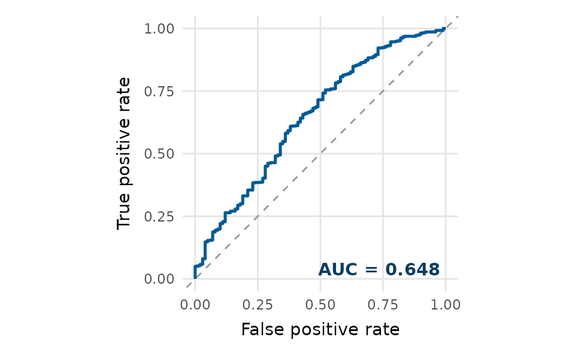

When the positive class is rare, the precision-recall curve is more
informative than the ROC curve:

``` r

pr_curve_plot(gfit)
```

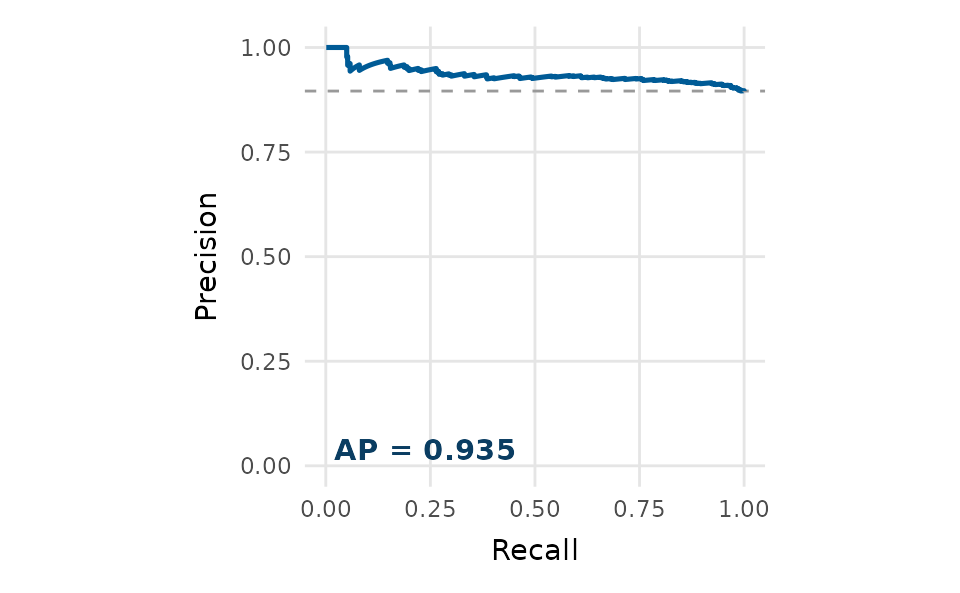

For ranking and targeting tasks, the cumulative gains and lift charts
show how many positive cases are captured as more of the score-ordered
population is targeted:

``` r

gain_plot(gfit)
```

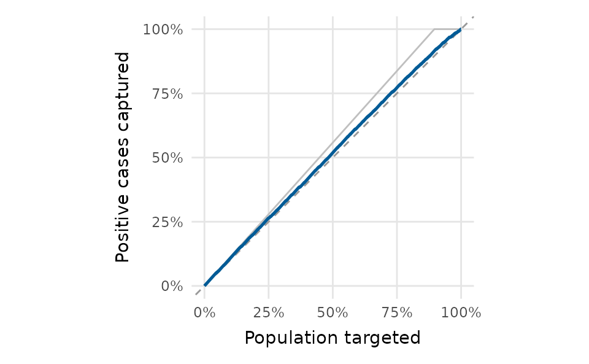

``` r

lift_plot(gfit)
```

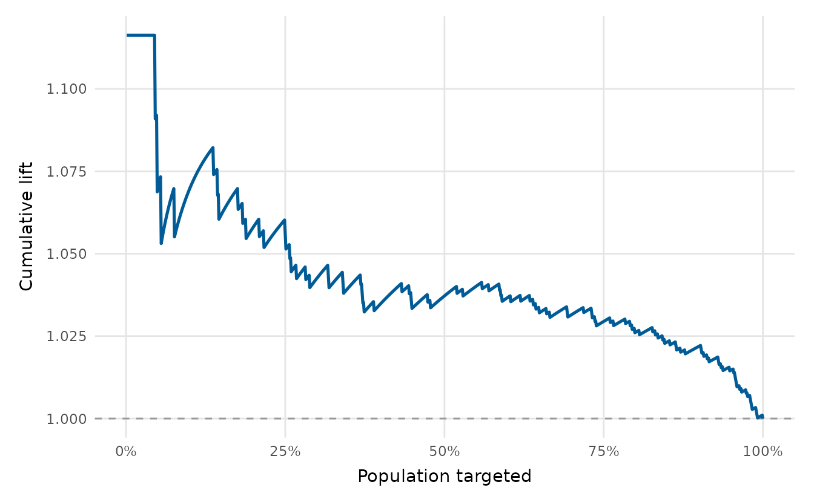

``` r

calibration_plot(gfit, bins = 8)
```

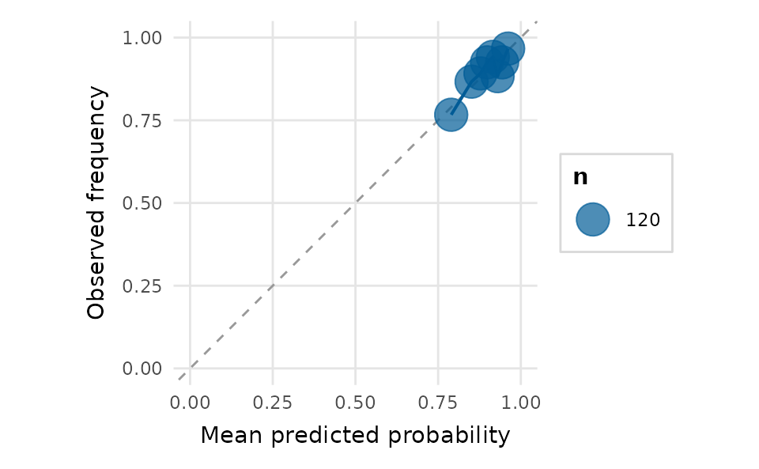

``` r

confusion_matrix_plot(gfit, threshold = 0.5, normalize = "row")
```

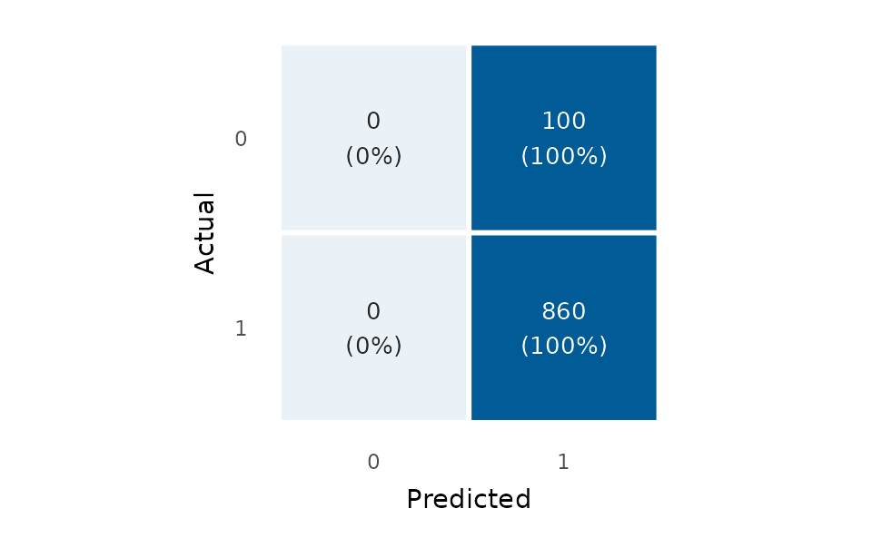

## Uncertainty

[`posterior_plot()`](https://pablobernabeu.github.io/depictr/reference/posterior_plot.md)
summarises draws (posterior, bootstrap, simulation) as a point with
nested intervals.

``` r

set.seed(2)
draws <- data.frame(
  stress = rnorm(2000, -0.45, 0.08),
  sleep = rnorm(2000, 0.25, 0.06),
  exercise = rnorm(2000, 0.15, 0.05)
)
posterior_plot(draws, title = "Posterior estimates")
```

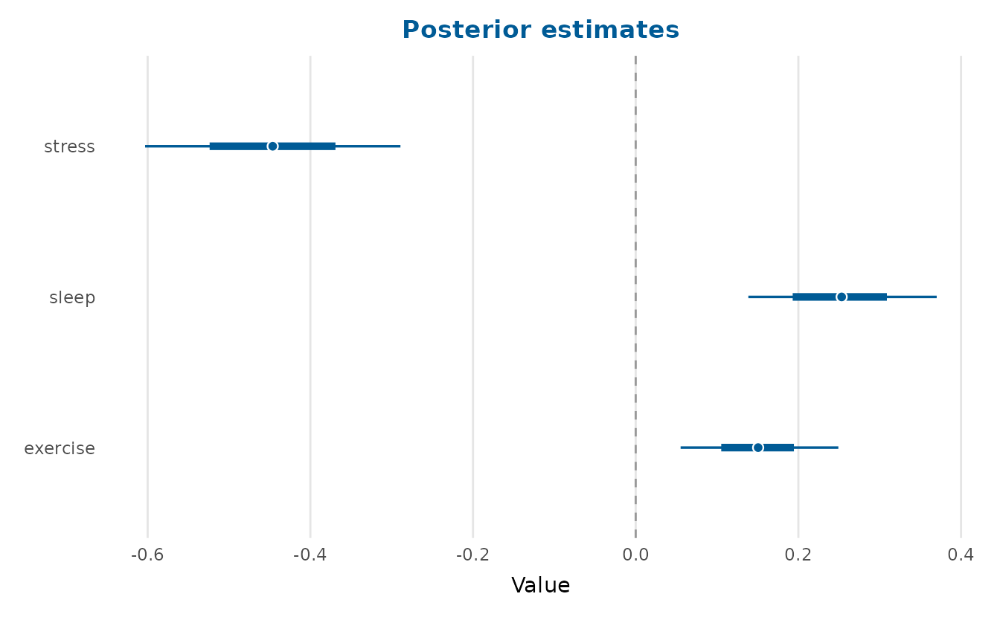

## Power curves

[`power_curve_plot()`](https://pablobernabeu.github.io/depictr/reference/power_curve_plot.md)
reads a
[`simr::powerCurve()`](https://rdrr.io/pkg/simr/man/powerCurve.html)
object or a tidy data frame, so a slow power simulation does not have to
be re-run to redraw it.

``` r

pc <- data.frame(nlevels = seq(10, 70, by = 10),
                 mean  = c(0.16, 0.31, 0.48, 0.63, 0.78, 0.88, 0.94),
                 lower = c(0.09, 0.23, 0.39, 0.54, 0.70, 0.82, 0.89),
                 upper = c(0.25, 0.40, 0.57, 0.71, 0.85, 0.93, 0.97))
power_curve_plot(pc, x_lab = "Number of participants",
                 title = "Power for the condition effect")
```

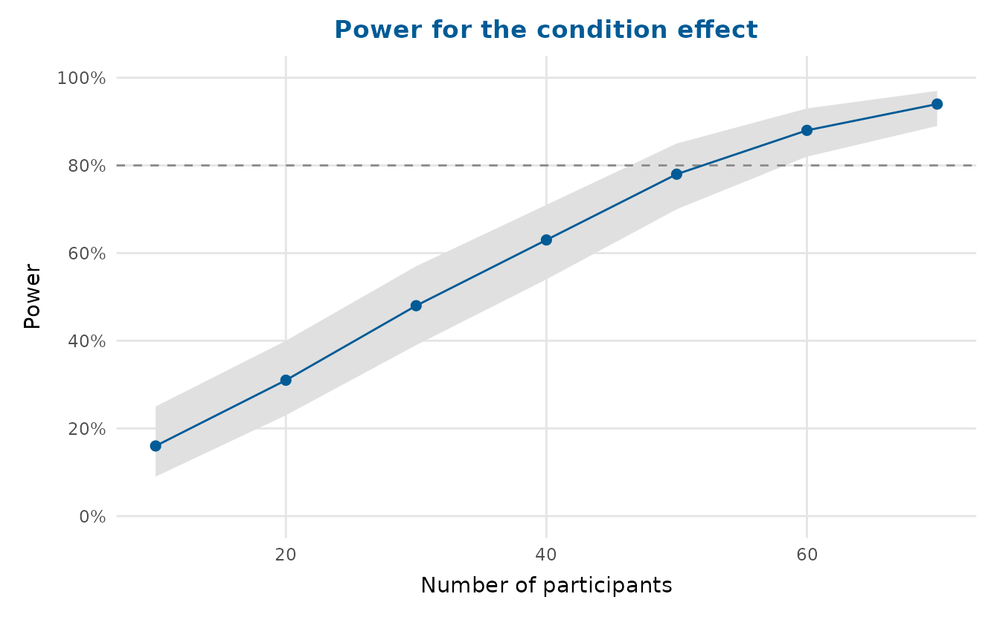

## Composing and saving

Combine any of these with
[`arrange_plots()`](https://pablobernabeu.github.io/depictr/reference/arrange_plots.md)
and save with
[`save_plot()`](https://pablobernabeu.github.io/depictr/reference/save_plot.md):

``` r

arrange_plots(
  qq_plot(fit), influence_plot(fit),
  ncol = 2, title = "Diagnostics", tag_levels = "A"
)
```

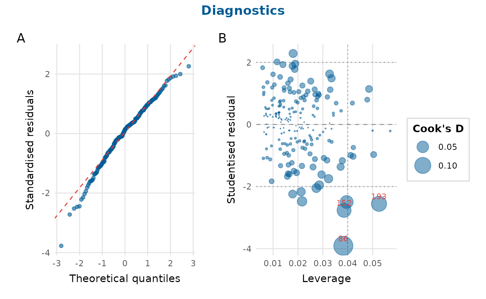

## References

Cook, R. D. (1977). Detection of influential observation in linear
regression. *Technometrics*, *19*(1), 15–18.
<https://doi.org/10.1080/00401706.1977.10489493>
