# Exploring data

depictr provides a coherent set of exploratory plots, estimation plots
and a descriptive table, all sharing the package theme and palette.
Column names can be given quoted or unquoted. The examples use the
bundled `lexical_decision`, `wellbeing_survey` and `crop_yield`
datasets. A closing section shows how to customise any of these plots
with ordinary ggplot2 code.

## One variable

[`explore_distribution()`](https://pablobernabeu.github.io/depictr/reference/explore_distribution.md)
for a numeric variable,
[`explore_categorical()`](https://pablobernabeu.github.io/depictr/reference/explore_categorical.md)
for a categorical one. A unimodal density leaves its upper corners
empty, so `legend_inside = TRUE` tucks the colour legend into the
top-right rather than spending a right-hand margin on it. Several plots
take this argument; it is off by default because the empty corner
depends on the data.

``` r

explore_distribution(lexical_decision, RT, group = condition, type = "density",
                     legend_inside = TRUE)
```

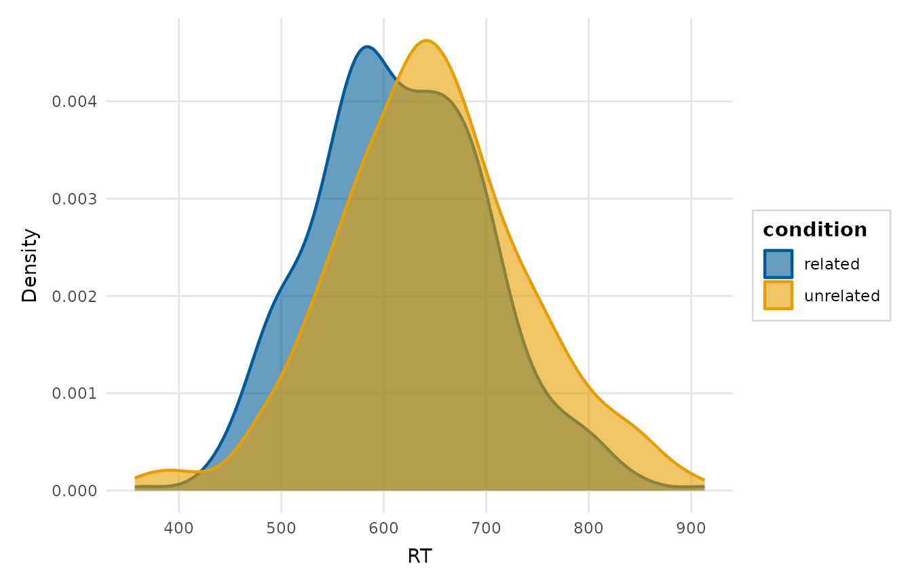

An overlay gets crowded once there are several groups, so `facet = TRUE`
gives each group its own panel:

``` r

explore_distribution(wellbeing_survey, life_satisfaction, group = region,
                     type = "both", facet = TRUE)
```

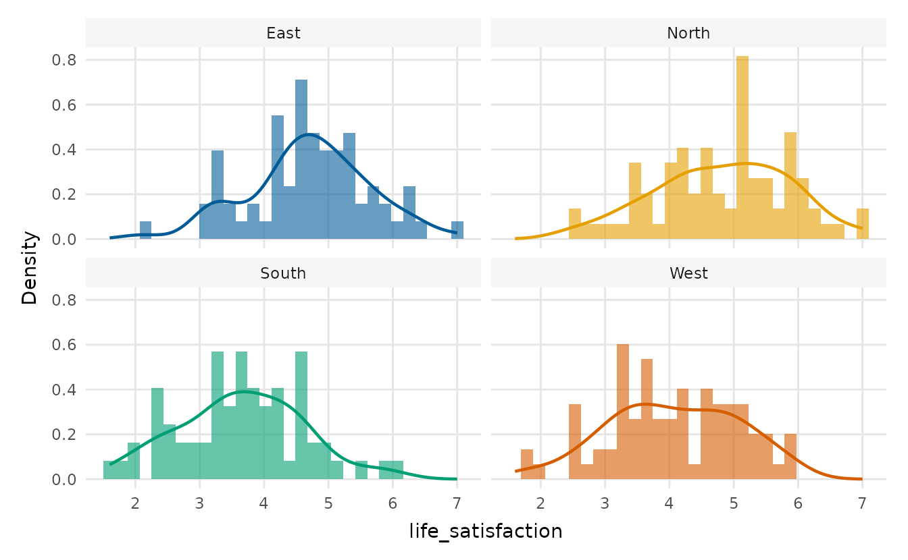

[`ecdf_plot()`](https://pablobernabeu.github.io/depictr/reference/ecdf_plot.md)
is a bin-free alternative: the empirical cumulative distribution lets
you read medians and quantiles straight off the curve and makes a shift
between groups obvious (here the related condition is faster
throughout).

``` r

ecdf_plot(lexical_decision, RT, group = condition,
          reference_quantiles = c(0.25, 0.5, 0.75), legend_inside = TRUE)
```

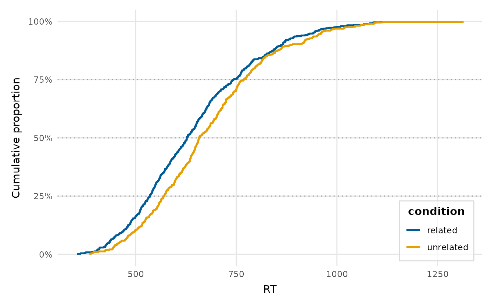

``` r

explore_categorical(wellbeing_survey, education, group = region,
                    proportion = TRUE, position = "dodge")
```

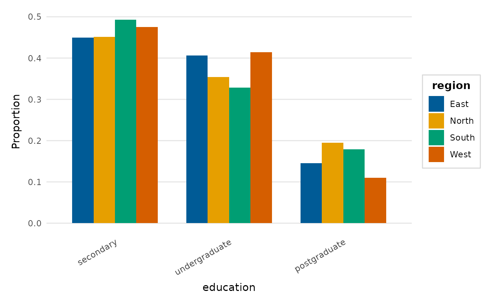

## Two variables, any types

[`explore_bivariate()`](https://pablobernabeu.github.io/depictr/reference/explore_bivariate.md)
selects the appropriate plot automatically: a scatter plot for two
numeric variables, box plots for a numeric variable against a
categorical one, and a filled bar chart for two categorical variables.

``` r

explore_bivariate(lexical_decision, condition, RT)
```

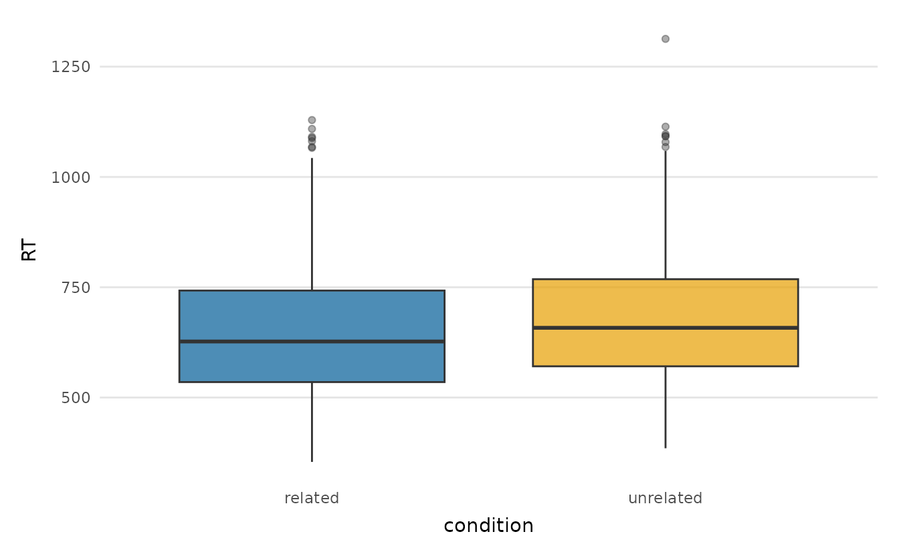

For a focused scatter with a fitted trend, use
[`scatter_trend()`](https://pablobernabeu.github.io/depictr/reference/scatter_trend.md).
The crop-yield trial has a real fertiliser-by-treatment interaction,
visible here as two diverging slopes.

``` r

scatter_trend(crop_yield, fertiliser, yield, group = treatment)
```

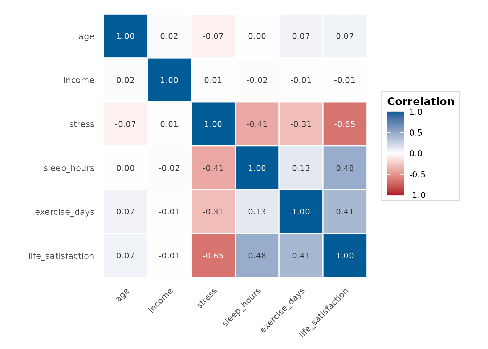

## Many variables at once

[`explore_pairs()`](https://pablobernabeu.github.io/depictr/reference/explore_pairs.md)
is a scatter-plot matrix;
[`correlation_heatmap()`](https://pablobernabeu.github.io/depictr/reference/correlation_heatmap.md)
condenses the same information into a single coloured grid.

``` r

explore_pairs(crop_yield, cols = c("rainfall", "fertiliser", "soil_ph", "yield"))
```

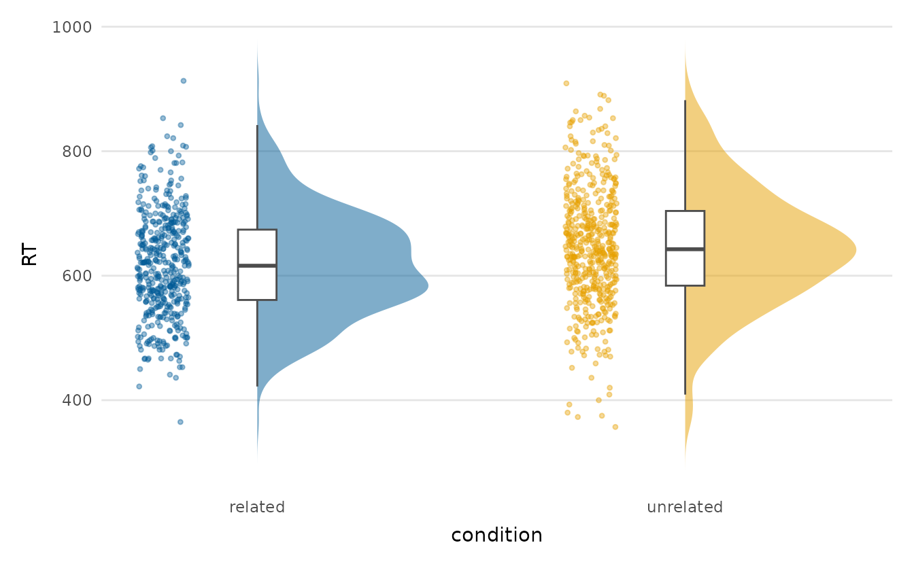

``` r

correlation_heatmap(wellbeing_survey)
```

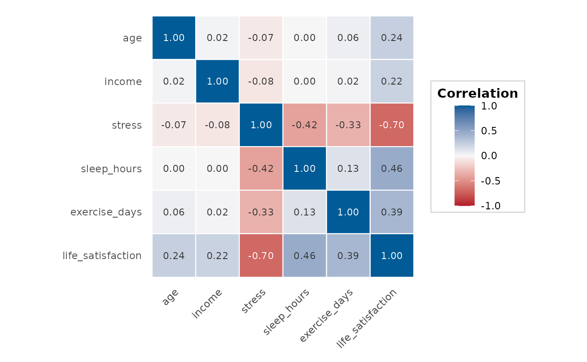

`reorder = TRUE` orders the variables by hierarchical clustering, so
blocks of mutually correlated variables sit together and the structure
is easier to read:

``` r

correlation_heatmap(wellbeing_survey, reorder = TRUE)
```

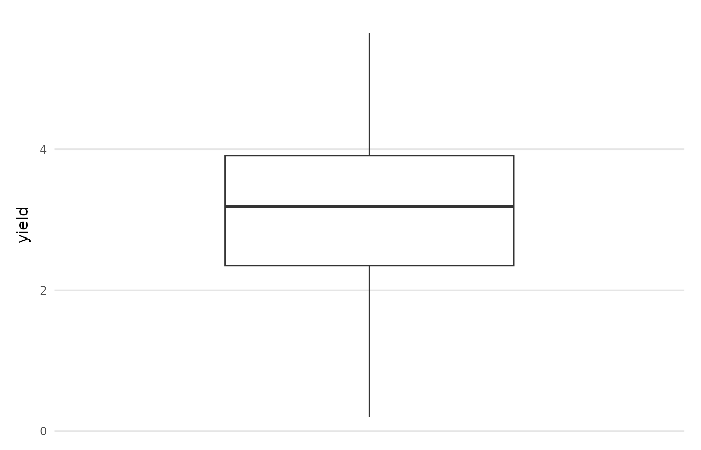

## Distributions across groups

[`raincloud_plot()`](https://pablobernabeu.github.io/depictr/reference/raincloud_plot.md)
shows the density, the box summary and the raw points together, and
[`group_comparison_plot()`](https://pablobernabeu.github.io/depictr/reference/group_comparison_plot.md)
adds the group means with confidence intervals over the raw data. By
showing the estimate alongside its uncertainty, the latter conveys
whether the groups differ more faithfully than a bar chart.

``` r

raincloud_plot(lexical_decision, RT, group = condition)
```

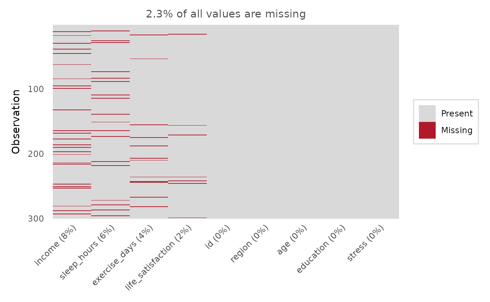

``` r

group_comparison_plot(lexical_decision, RT, condition)
```

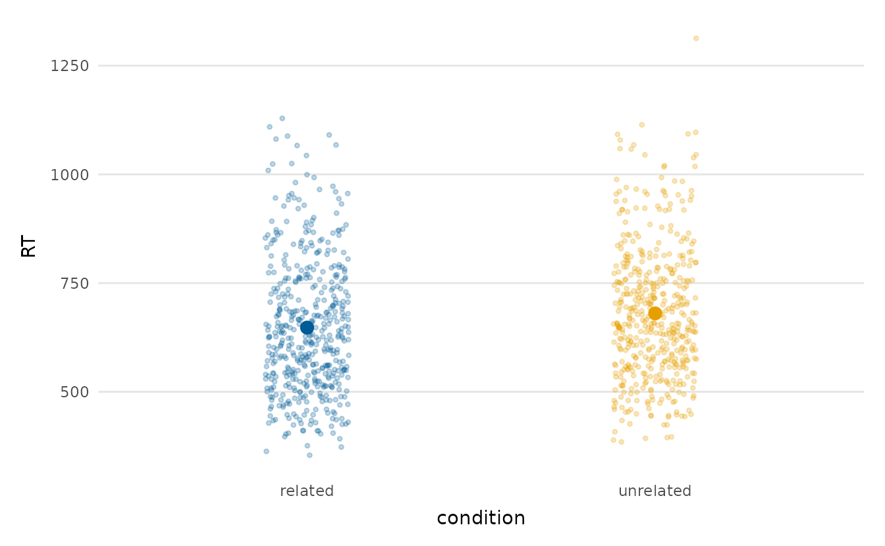

To compare the *shape* of a distribution across several groups at once,
[`ridgeline_plot()`](https://pablobernabeu.github.io/depictr/reference/ridgeline_plot.md)
stacks one partially overlapping density per group:

``` r

ridgeline_plot(wellbeing_survey, life_satisfaction, region)
```

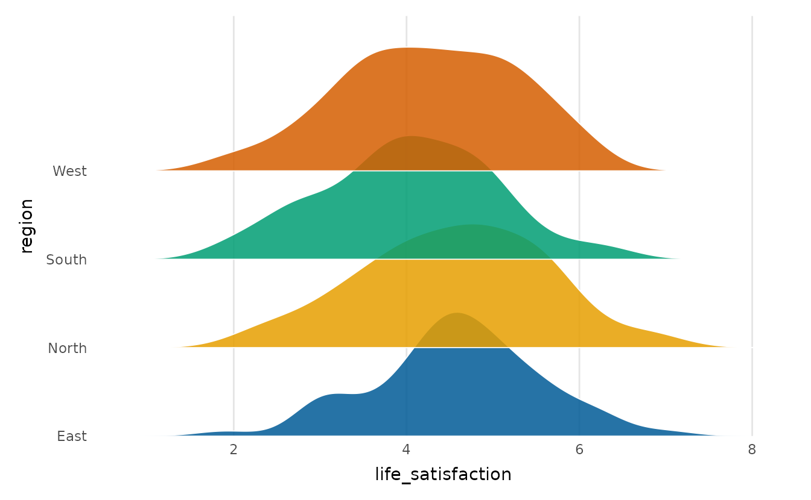

## Estimation plots: effect size rather than a p-value

An *estimation plot* puts the effect size and its uncertainty at the
centre of the comparison.
[`estimation_plot()`](https://pablobernabeu.github.io/depictr/reference/estimation_plot.md)
draws the classic Gardner-Altman two-group plot: the raw data with group
means on top, and the mean difference with a bootstrap confidence
interval beneath, aligned so a difference of zero sits under the
reference group’s mean. With two groups it also annotates a standardised
effect size (Hedges’ *g* by default).

``` r

set.seed(1)
estimation_plot(lexical_decision, RT, condition,
                title = "RT difference: unrelated vs. related priming")
```

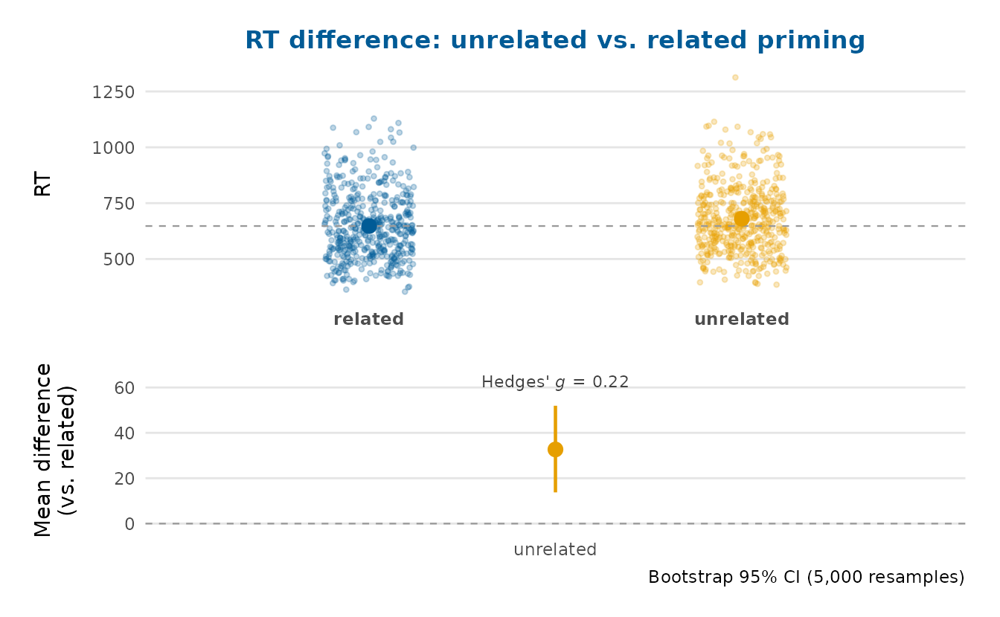

`group_comparison_plot(differences = TRUE)` is the same idea reached
from the group-means plot: it appends the difference panel, turning a
means comparison into a full estimation plot. With more than two groups
every other group is compared against a chosen reference (a Cumming
plot).

``` r

set.seed(1)
group_comparison_plot(crop_yield, yield, treatment, differences = TRUE,
                      title = "Yield difference: enhanced vs. standard")
```

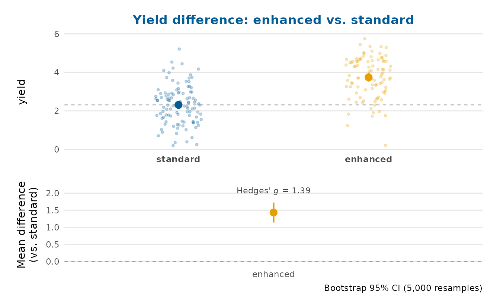

## Comparing two groups across categories

[`dumbbell_plot()`](https://pablobernabeu.github.io/depictr/reference/dumbbell_plot.md)
compares one value between two groups across a set of categories: the
two group values per category are joined by a segment, so the size and
direction of each gap is clear at a glance. Here it contrasts younger
and older respondents’ life satisfaction by region.

``` r

wb <- wellbeing_survey
wb$age_group <- ifelse(wb$age < median(wb$age), "younger", "older")
dumbbell_plot(wb, region, life_satisfaction, age_group, legend_inside = TRUE)
```

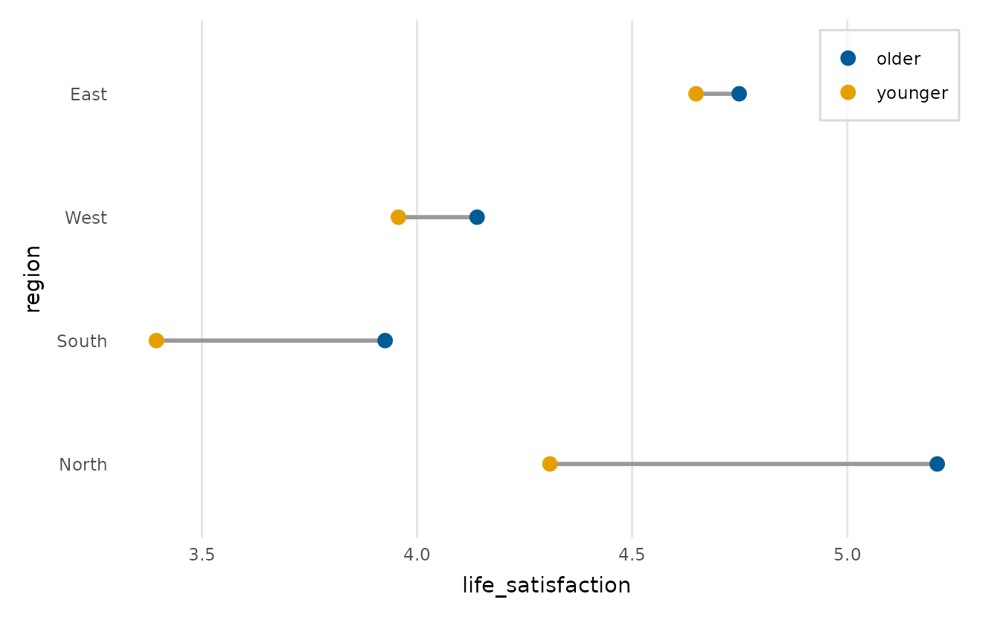

## Data quality: outliers and missingness

``` r

outlier_plot(crop_yield, yield)
```

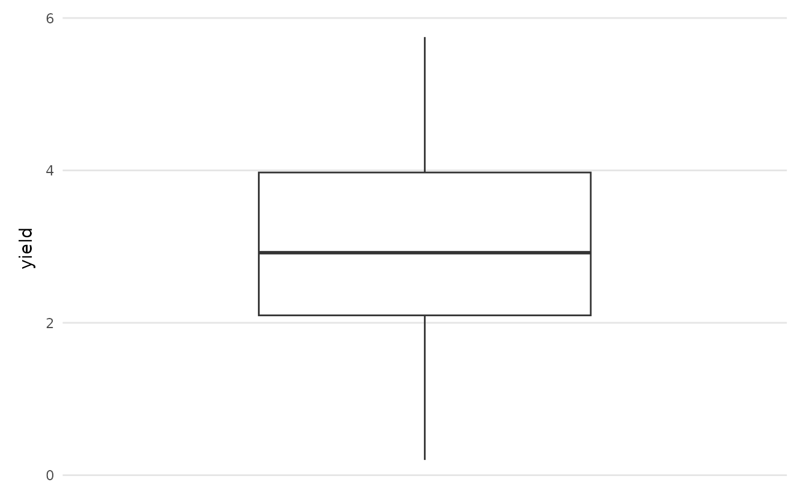

`wellbeing_survey` has *informative* missingness (income is missing more
often at higher stress), so the missingness map is worth a look before
modelling.

``` r

missingness_map(wellbeing_survey, legend_inside = TRUE)
```

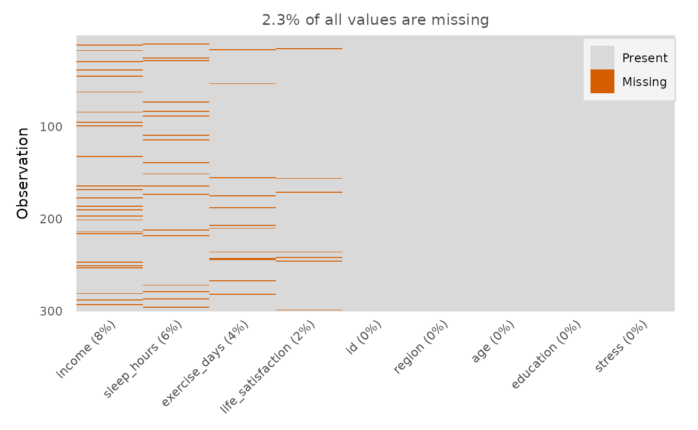

## A descriptive summary table

[`summary_table()`](https://pablobernabeu.github.io/depictr/reference/summary_table.md)
builds a ‘Table 1’: mean (SD) for numeric variables, counts and
percentages for categorical ones, optionally by group. The first row
always reports the sample size (`N`), and any variable with missing
values gets a `Missing, n (%)` row, both visible here for the wellbeing
survey. It returns a plain data frame, ready for
[`knitr::kable()`](https://rdrr.io/pkg/knitr/man/kable.html).

``` r

tab <- summary_table(
  wellbeing_survey,
  vars = c("life_satisfaction", "income", "stress", "education"),
  group = "region"
)
knitr::kable(tab)
```

| variable | statistic | Overall | East | North | South | West |
|:---|:---|:---|:---|:---|:---|:---|
| N |  | 300 | 69 | 82 | 67 | 82 |
| life_satisfaction | Mean (SD) | 4.4 (1.0) | 4.6 (1.0) | 4.5 (1.1) | 4.0 (1.0) | 4.3 (1.0) |
|  | Missing, n (%) | 7 (2%) | 1 (1%) | 3 (4%) | 1 (1%) | 2 (2%) |
| income | Mean (SD) | 31126.9 (13354.8) | 30960.9 (12789.8) | 31706.4 (13884.6) | 29459.5 (12954.0) | 31955.4 (13700.7) |
|  | Missing, n (%) | 25 (8%) | 7 (10%) | 6 (7%) | 8 (12%) | 4 (5%) |
| stress | Mean (SD) | 4.0 (1.3) | 3.9 (1.2) | 3.8 (1.5) | 4.3 (1.2) | 3.9 (1.3) |
| education | secondary | 140 (47%) | 31 (45%) | 37 (45%) | 33 (49%) | 39 (48%) |
|  | undergraduate | 113 (38%) | 28 (41%) | 29 (35%) | 22 (33%) | 34 (41%) |
|  | postgraduate | 47 (16%) | 10 (14%) | 16 (20%) | 12 (18%) | 9 (11%) |

## Customising and extending the plots

Every depictr function returns a plain `ggplot2` object (composite
figures return a `patchwork`), so you can keep adding layers, scales,
labels and theme tweaks with the usual `+`:

``` r

library(ggplot2)

scatter_trend(crop_yield, fertiliser, yield, group = treatment) +
  labs(title = "Yield rises with fertiliser",
       subtitle = "More steeply under the enhanced treatment") +
  theme(legend.position = "bottom")
```

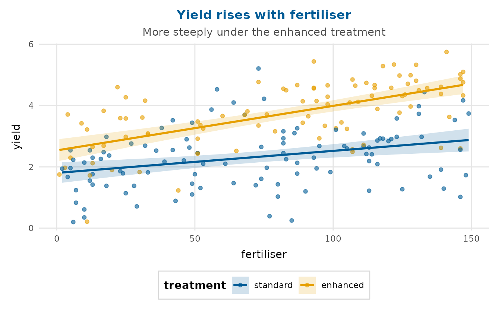

### Tidying the legend

depictr centres a legend title over its keys by default. When the levels
speak for themselves, though, the title is just clutter, so drop it by
mapping it to `NULL`. Reversing a discrete colour legend at the same
time makes it read top-to-bottom in the order the curves are stacked:

``` r

ecdf_plot(lexical_decision, RT, group = condition) +
  labs(colour = NULL) +
  guides(colour = guide_legend(reverse = TRUE))
```

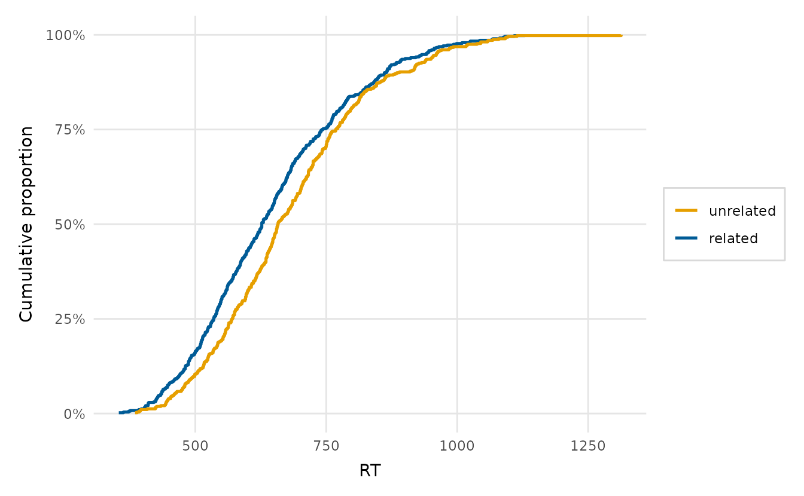

### Moving the legend into the plot

Several plots take `legend_inside = TRUE` to tuck the legend into a
corner they usually leave empty (see
e.g. [`?ecdf_plot`](https://pablobernabeu.github.io/depictr/reference/ecdf_plot.md)).
For any plot that does not, the same move is one
[`theme()`](https://ggplot2.tidyverse.org/reference/theme.html) call. A
dodged bar chart, for instance, leaves the top-right clear when the
right-most category is short, so the legend fits there. Because the
regions are self-evident, we drop the title too (with
[`element_blank()`](https://ggplot2.tidyverse.org/reference/element.html),
since this plot sets the legend name on its fill scale):

``` r

explore_categorical(wellbeing_survey, education, group = region,
                    proportion = TRUE, position = "dodge") +
  theme(legend.position = "inside",
        legend.position.inside = c(0.98, 0.98),
        legend.justification = c(1, 1),
        legend.title = element_blank())
```

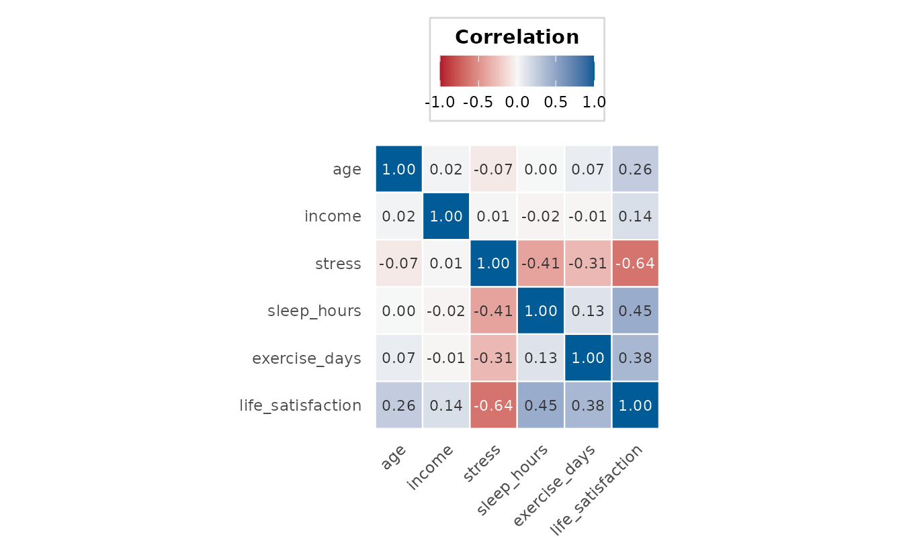

### Built-in layout controls

Many functions also expose layout controls directly.
`explore_distribution(facet = TRUE)` and
[`ridgeline_plot()`](https://pablobernabeu.github.io/depictr/reference/ridgeline_plot.md)
separate groups, `correlation_heatmap(reorder = TRUE)` clusters
variables, and the model-estimate plots take `facet` and `standardise`
to keep coefficients on very different scales legible (see
[`vignette("model-estimates")`](https://pablobernabeu.github.io/depictr/articles/model-estimates.md)).
