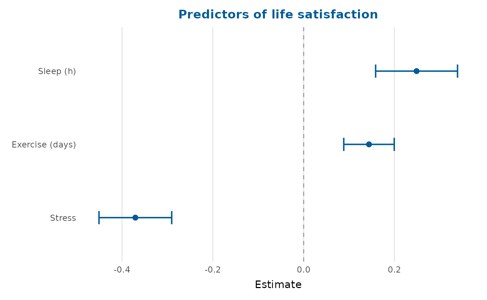
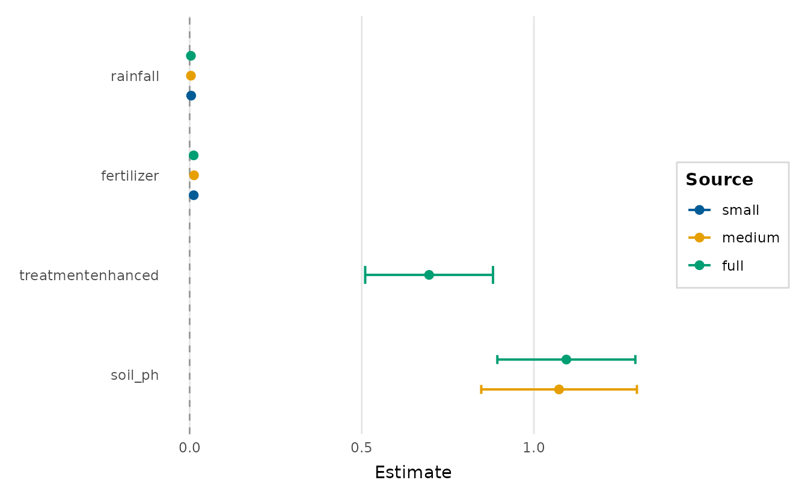
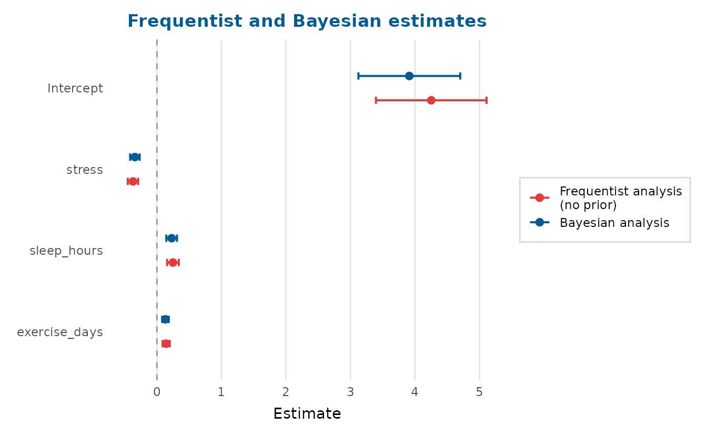
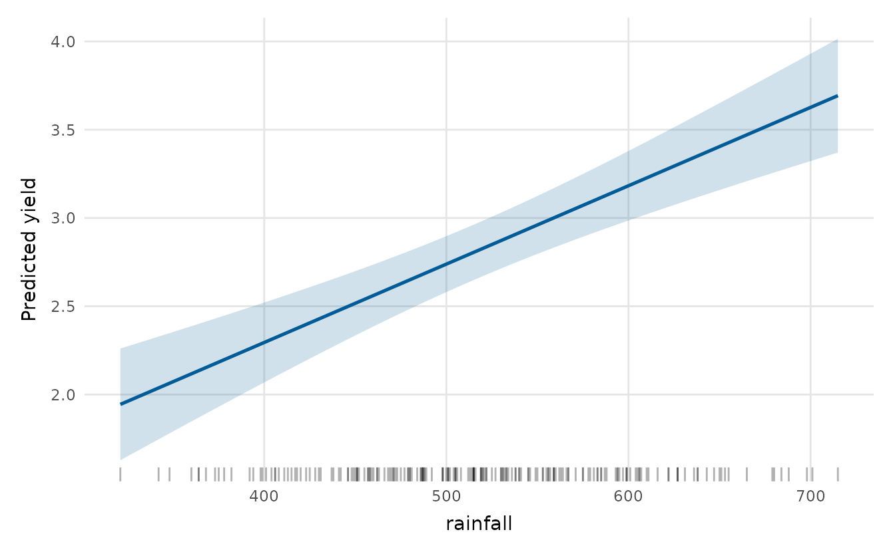
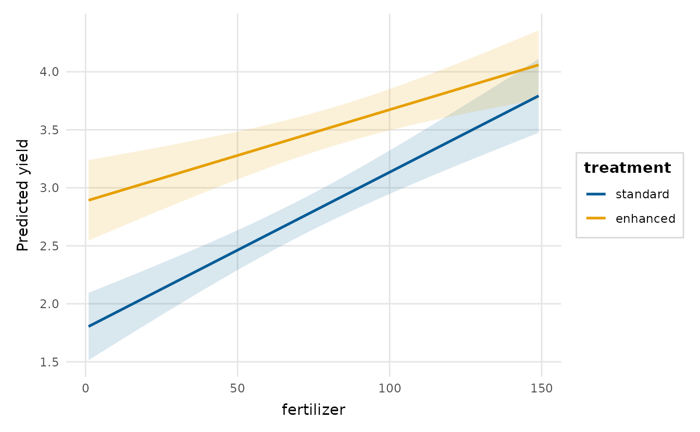
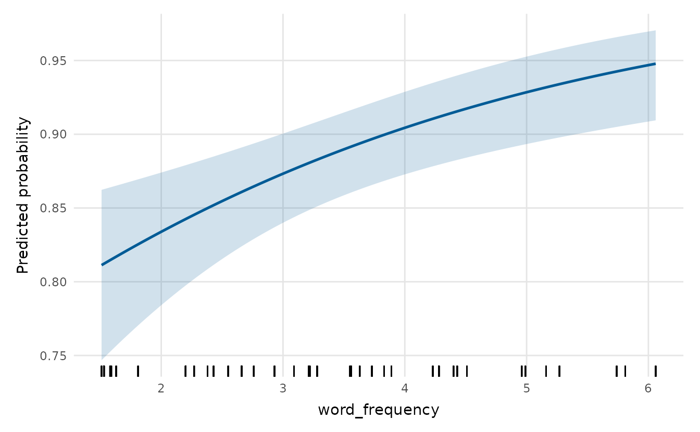
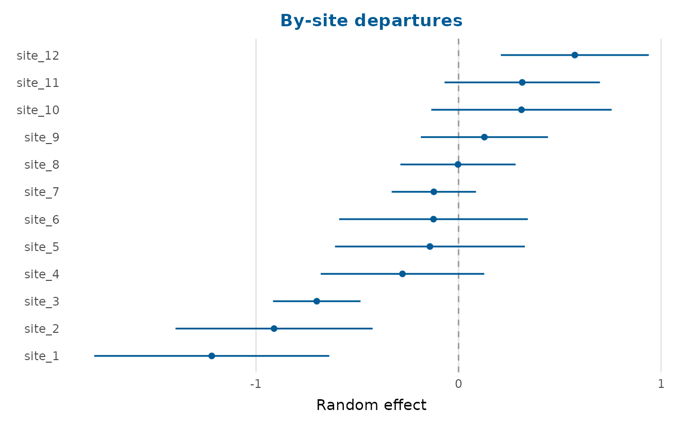
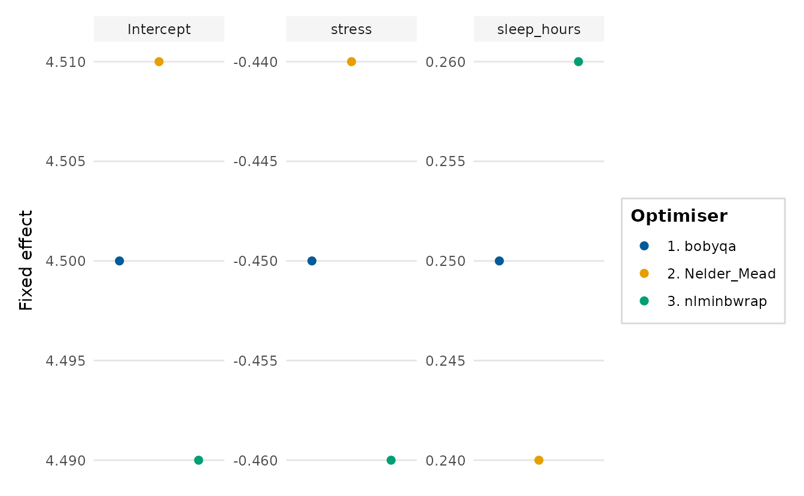
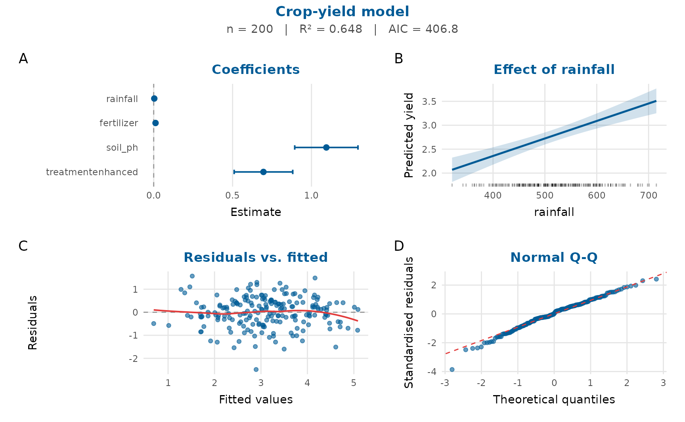

# Visualising model estimates

This vignette covers the model-result plots: coefficients, model
comparison, predicted values, interactions, random effects and
goodness-of-fit.

## Coefficient (forest) plots

[`coefficient_plot()`](https://pablobernabeu.github.io/depictr/reference/coefficient_plot.md)
accepts any model
[`tidy_estimates()`](https://pablobernabeu.github.io/depictr/reference/tidy_estimates.md)
understands, or a tidy data frame.

``` r

fit <- lm(life_satisfaction ~ stress + sleep_hours + exercise_days,
          data = wellbeing_survey)
coefficient_plot(fit, order = "ascending",
                 labels = c(stress = "Stress", sleep_hours = "Sleep (h)",
                            exercise_days = "Exercise (days)"),
                 title = "Predictors of life satisfaction")
#> `height` was translated to `width`.
```



## Comparing models

[`compare_models()`](https://pablobernabeu.github.io/depictr/reference/compare_models.md)
overlays the estimates from several models, and
[`model_fit_table()`](https://pablobernabeu.github.io/depictr/reference/model_fit_table.md)
summarises their fit.

``` r

m1 <- lm(yield ~ rainfall + fertilizer, data = crop_yield)
m2 <- lm(yield ~ rainfall + fertilizer + soil_ph, data = crop_yield)
m3 <- lm(yield ~ rainfall + fertilizer + soil_ph + treatment, data = crop_yield)

compare_models(small = m1, medium = m2, full = m3, order = "descending")
#> `height` was translated to `width`.
```



``` r

knitr::kable(model_fit_table(small = m1, medium = m2, full = m3))
```

| model  |   n |  df |     AIC |     BIC |   logLik |    R2 |  RMSE |
|:-------|----:|----:|--------:|--------:|---------:|------:|------:|
| small  | 200 |   4 | 526.072 | 539.266 | -259.036 | 0.348 | 0.884 |
| medium | 200 |   5 | 454.182 | 470.674 | -222.091 | 0.549 | 0.735 |
| full   | 200 |   6 | 406.816 | 426.606 | -197.408 | 0.648 | 0.649 |

For `glm` models the `R2` column reports McFadden’s pseudo-R-squared
([McFadden, 1974](#ref-mcfadden1974)) in place of the ordinary
coefficient of determination.

## Frequentist and Bayesian estimates together

``` r

freq  <- lm(life_satisfaction ~ stress + sleep_hours + exercise_days,
            data = wellbeing_survey)
bayes <- tidy_estimates(freq)
bayes$estimate  <- bayes$estimate * 0.92      # stand-in posterior means
bayes$conf.low  <- bayes$conf.low * 0.92
bayes$conf.high <- bayes$conf.high * 0.92

frequentist_bayesian_plot(freq, bayes, note_frequentist_no_prior = TRUE,
                          title = "Frequentist and Bayesian estimates")
#> `height` was translated to `width`.
```



## Predicted values and interactions

[`effects_plot()`](https://pablobernabeu.github.io/depictr/reference/effects_plot.md)
shows what the model predicts as one predictor varies;
[`interaction_plot()`](https://pablobernabeu.github.io/depictr/reference/interaction_plot.md)
shows how that relationship changes across a second predictor.

``` r

fit2 <- lm(yield ~ fertilizer * treatment + rainfall, data = crop_yield)
effects_plot(fit2, "rainfall")
```



``` r

interaction_plot(fit2, "fertilizer", "treatment")
```



For a binomial `glm`, predictions are shown on the probability scale:

``` r

gfit <- glm(accuracy ~ word_frequency + condition, data = lexical_decision,
            family = binomial)
effects_plot(gfit, "word_frequency")
```



## Random effects

[`random_effects_plot()`](https://pablobernabeu.github.io/depictr/reference/random_effects_plot.md)
draws a caterpillar plot. It reads an ‘lme4’ model directly, or a data
frame of by-group estimates:

``` r

re <- data.frame(level = paste0("site_", 1:12),
                 estimate = sort(rnorm(12, 0, 0.5)),
                 std.error = runif(12, 0.1, 0.3))
random_effects_plot(re, title = "By-site departures")
#> `height` was translated to `width`.
```



## Optimiser checks

When a mixed model is fitted by several optimisers (via
[`lme4::allFit()`](https://rdrr.io/pkg/lme4/man/allFit.html)),
[`optimizer_fixef_plot()`](https://pablobernabeu.github.io/depictr/reference/optimizer_fixef_plot.md)
shows whether they agree. Without ‘lme4’ you can build the input
directly:

``` r

opt <- expand.grid(optimizer = c("bobyqa", "Nelder_Mead", "nlminbwrap"),
                   term = c("(Intercept)", "stress", "sleep_hours"))
opt$value <- c(4.5, 4.51, 4.49, -0.45, -0.44, -0.46, 0.25, 0.24, 0.26)
optimizer_fixef_plot(opt)
```



## A one-figure model report

[`model_report()`](https://pablobernabeu.github.io/depictr/reference/model_report.md)
composes several of these views (the coefficients, the effect of a focal
predictor, the residuals against fitted values and a Q-Q plot, with a
fit-statistics subtitle) into a single figure for a rapid review or a
report appendix.

``` r

full <- lm(yield ~ rainfall + fertilizer + soil_ph + treatment,
           data = crop_yield)
model_report(full, title = "Crop-yield model")
#> `height` was translated to `width`.
```



## References

McFadden, D. (1974). Conditional logit analysis of qualitative choice
behavior. In P. Zarembka (Ed.), *Frontiers in econometrics* (pp.
105–142). Academic Press.
