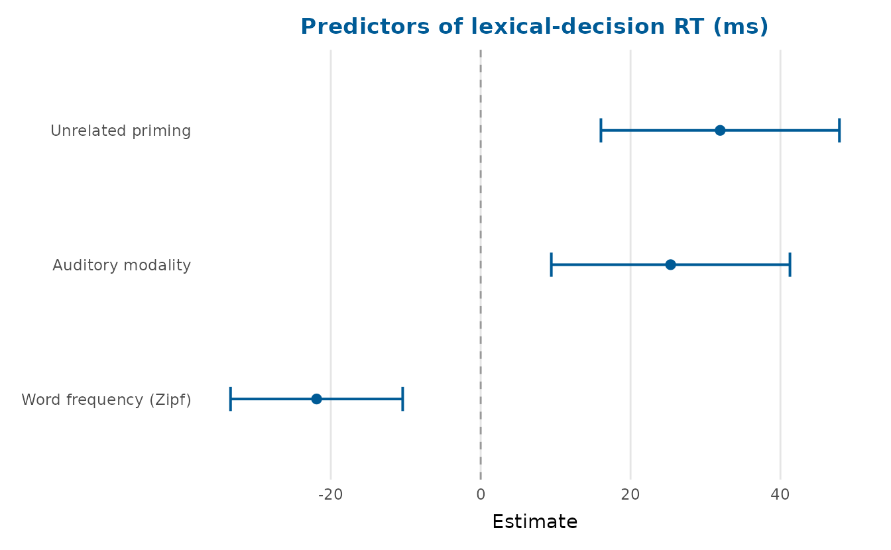
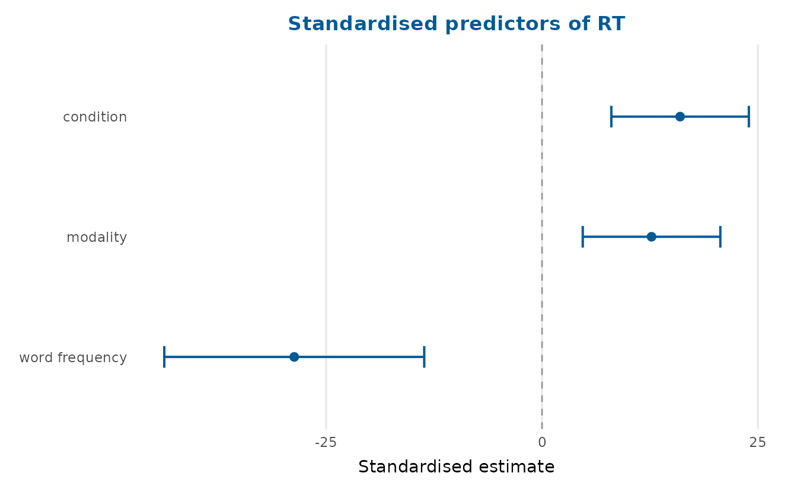
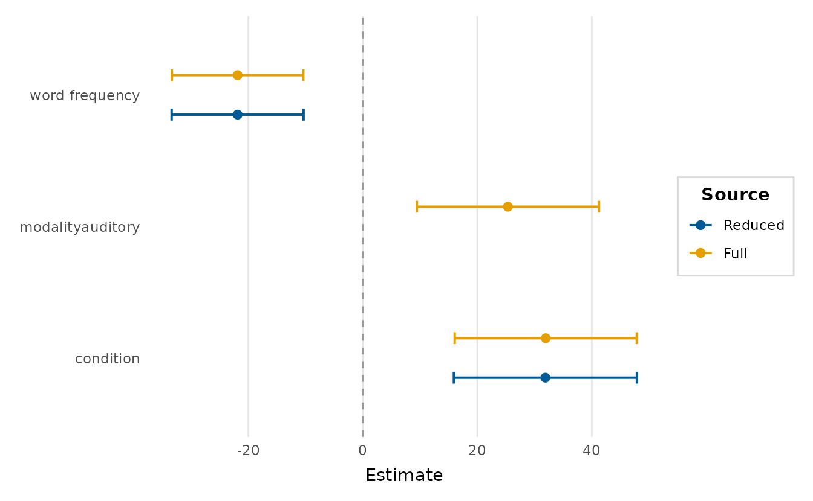
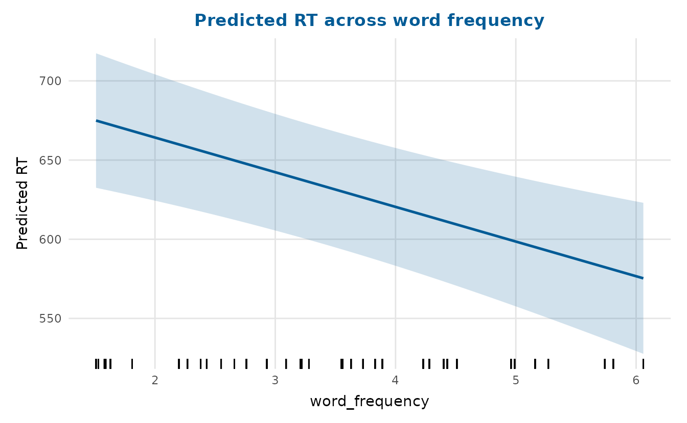
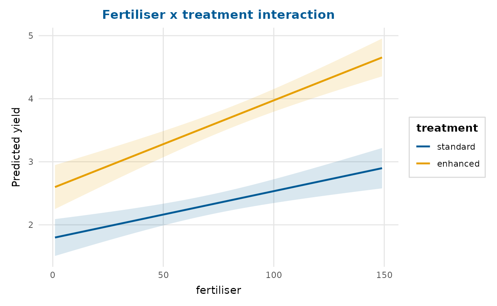
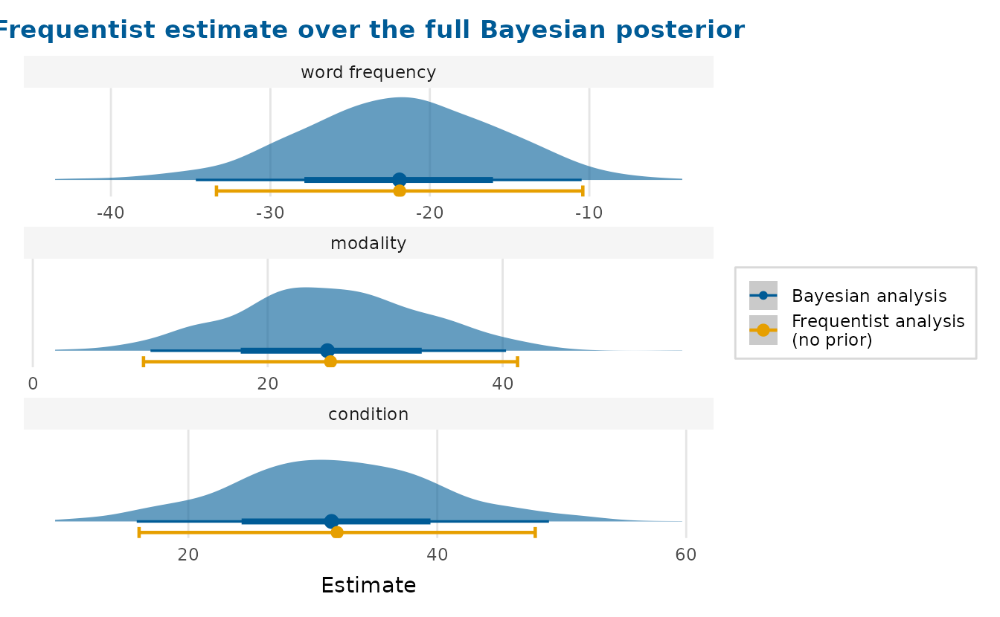
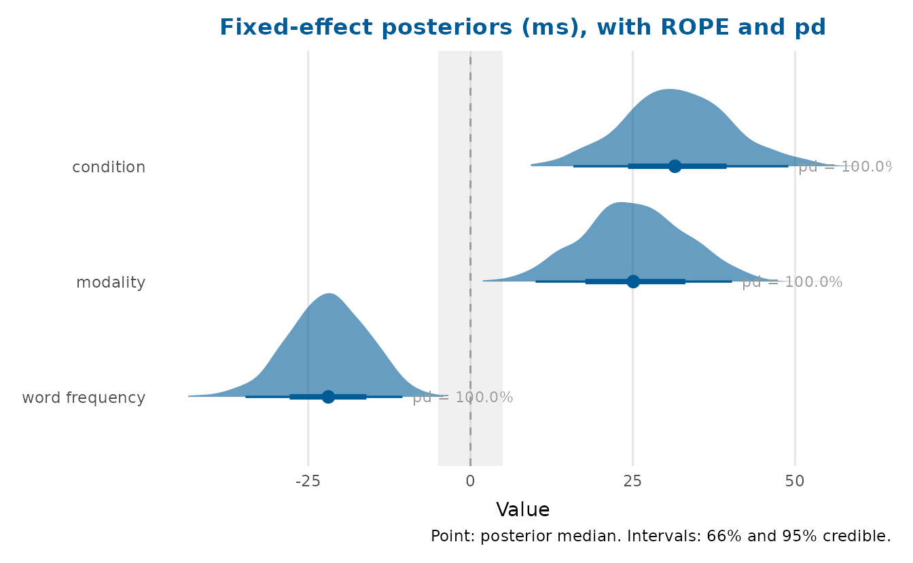
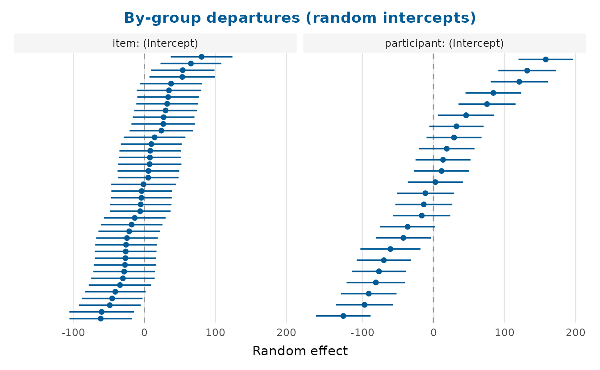
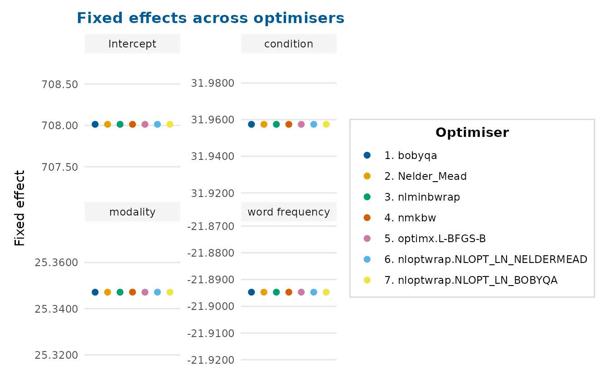
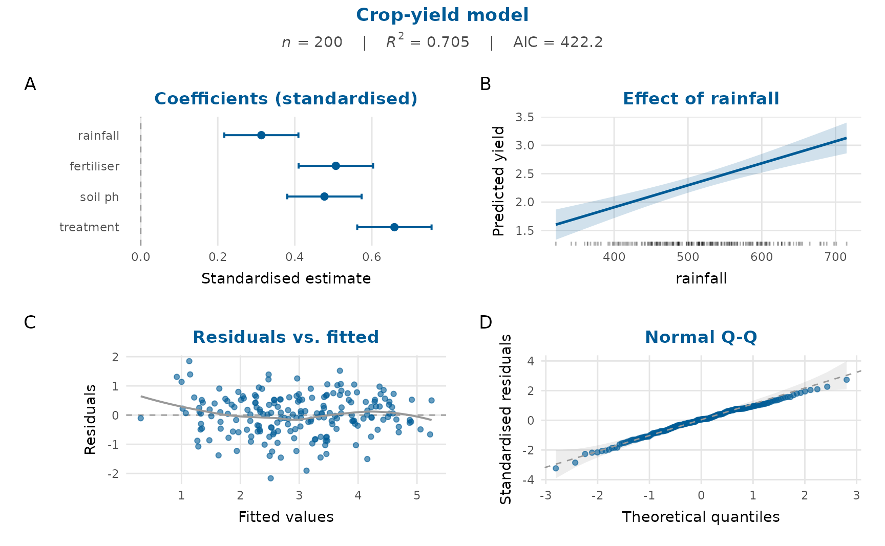

# Visualising model estimates

This is the flagship article. It works through depictr’s model-result
plots (coefficients, model comparison, predicted values, interactions,
random effects and goodness-of-fit) and then reaches the capability that
[`frequentist_bayesian_plot()`](https://pablobernabeu.github.io/depictr/reference/frequentist_bayesian_plot.md)
is named for: showing a frequentist estimate and a full Bayesian
posterior for the same model on one figure.

The running example is `lexical_decision`, a counterbalanced, crossed
lexical-decision experiment (24 participants, 40 items, 960 trials). We
model reaction time on correct trials as a function of priming
`condition` (related/unrelated), presentation `modality`
(visual/auditory) and item `word_frequency`, with crossed random
intercepts for participant and item. The design is counterbalanced, so
neither fixed factor is collinear with the item random effect, a clean
fit for a mixed model.

``` r

correct <- subset(lexical_decision, accuracy == 1)
fit <- lmerTest::lmer(
  RT ~ condition + modality + word_frequency +
    (1 | participant) + (1 | item),
  data = correct
)
```

## Coefficient (forest) plots

[`coefficient_plot()`](https://pablobernabeu.github.io/depictr/reference/coefficient_plot.md)
reads the fitted mixed model directly (through
[`tidy_estimates()`](https://pablobernabeu.github.io/depictr/reference/tidy_estimates.md))
and draws a horizontal point-and-interval (‘forest’) plot. Unrelated
primes and auditory presentation both slow responses, while more
frequent words speed them up.

``` r

coefficient_plot(
  fit, order = "ascending",
  labels = c(conditionunrelated = "Unrelated priming",
             modalityauditory = "Auditory modality",
             word_frequency = "Word frequency (Zipf)"),
  title = "Predictors of lexical-decision RT (ms)"
)
```



Coefficient names are tidied to the effect (variable) name automatically
(`conditionunrelated` becomes `condition`, `word_frequency` becomes
`word frequency`); pass `labels` to override any of them. The slopes
also sit on quite different scales, so `standardise = TRUE` rescales
each coefficient by its predictor’s standard deviation, putting them on
one comparable axis:

``` r

coefficient_plot(fit, standardise = TRUE, order = "ascending",
                 title = "Standardised predictors of RT")
```



To keep the raw units instead, including a large intercept that would
otherwise squash the slopes, `facet = TRUE` gives each term its own
free-scaled panel (the layout the frequentist-vs-Bayesian comparison
below uses by default).

## Comparing models

[`compare_models()`](https://pablobernabeu.github.io/depictr/reference/compare_models.md)
overlays the estimates from several models so you can see how a
coefficient moves as the specification changes. Here a reduced model
(dropping `modality`) is compared with the full model;
[`model_fit_table()`](https://pablobernabeu.github.io/depictr/reference/model_fit_table.md)
summarises their fit.

``` r

reduced <- lmerTest::lmer(
  RT ~ condition + word_frequency + (1 | participant) + (1 | item),
  data = correct
)
compare_models(Reduced = reduced, Full = fit, order = "descending")
```



``` r

knitr::kable(model_fit_table(Reduced = reduced, Full = fit))
```

| model   |   n |  df |      AIC |      BIC |    logLik |  R2 |    RMSE |
|:--------|----:|----:|---------:|---------:|----------:|----:|--------:|
| Reduced | 902 |   6 | 11338.03 | 11366.85 | -5663.014 |  NA | 118.790 |
| Full    | 902 |   7 | 11324.31 | 11357.94 | -5655.153 |  NA | 118.129 |

For `glm` models the `R2` column reports McFadden’s pseudo-R-squared
([McFadden, 1974](#ref-mcfadden1974)) in place of the ordinary
coefficient of determination.

## Predicted values and interactions

[`effects_plot()`](https://pablobernabeu.github.io/depictr/reference/effects_plot.md)
shows what the model predicts as one predictor varies, holding the
others at typical values. It also works on the mixed model: predictions
use the fixed effects only (`re.form = NA`) and the band is built from
the fixed-effect design matrix and
[`vcov()`](https://rdrr.io/r/stats/vcov.html).

``` r

effects_plot(fit, "word_frequency",
             title = "Predicted RT across word frequency")
```



[`interaction_plot()`](https://pablobernabeu.github.io/depictr/reference/interaction_plot.md)
shows how a relationship changes across a second predictor. The
lexical-decision model is additive, so for a *genuine* interaction we
switch to `crop_yield`, whose data-generating process contains a real
fertiliser-by-treatment effect: fertiliser raises yield far more under
the `enhanced` treatment than under `standard`, so the slopes diverge.

``` r

crop_fit <- lm(yield ~ fertiliser * treatment + rainfall, data = crop_yield)
interaction_plot(crop_fit, "fertiliser", "treatment",
                 title = "Fertiliser x treatment interaction")
```



## Frequentist and Bayesian estimates together

This is the capability
[`frequentist_bayesian_plot()`](https://pablobernabeu.github.io/depictr/reference/frequentist_bayesian_plot.md)
is named for. Given the frequentist fit and a set of Bayesian posterior
draws, the function draws the *full posterior distribution* for each
term (a ‘ggdist’ half-eye) and overlays the frequentist point and
confidence interval at the same position. The entire shape of the
posterior appears next to the frequentist estimate, rather than a point
and two limits alone, with the two sources in the two leading
colourblind-safe palette colours.

The draws here are the real fixed-effect posterior from a `brms` fit of
the same model (1000 draws x 4 parameters), shipped with the package so
the slow MCMC need not be re-run. Terms are matched by canonical label,
so the `brms` parameter names line up with the frequentist ones
automatically.

``` r

draws <- readRDS(system.file("extdata", "lexdec_draws.rds", package = "depictr"))

frequentist_bayesian_plot(
  fit, draws,
  intercept = FALSE,
  note_frequentist_no_prior = TRUE,
  title = "Frequentist estimate over the full Bayesian posterior"
)
```



The frequentist confidence interval and the bulk of the Bayesian
posterior land in the same place (reassuring agreement between the two
paradigms), but only the posterior shows the density, the skew and the
mass on either side of zero.

If `ggdist` is unavailable the function falls back to a
point-and-interval forest plot of the two sources, and when the Bayesian
side is supplied as a *summary* table instead of draws (for instance the
`Estimate`/`Q2.5`/`Q97.5` of `brms::fixef()`) it draws the familiar
two-source forest plot.

## Posterior distributions on their own

[`posterior_plot()`](https://pablobernabeu.github.io/depictr/reference/posterior_plot.md)
summarises any draws (posterior, bootstrap or simulation) as a
distribution per parameter. With `style = "halfeye"` it shows the
density slab and a point-and-interval; a region of practical equivalence
(ROPE) can be shaded and each parameter annotated with its probability
of direction (the posterior mass on its majority side of the reference
line).

``` r

draws <- readRDS(system.file("extdata", "lexdec_draws.rds", package = "depictr"))
slopes <- draws[c("conditionunrelated", "modalityauditory", "word_frequency")]

posterior_plot(
  slopes, style = "halfeye", rope = c(-5, 5), pd = TRUE,
  labels = c(conditionunrelated = "condition",
             modalityauditory = "modality",
             word_frequency = "word frequency"),
  title = "Fixed-effect posteriors (ms), with ROPE and pd"
)
```



The probability of direction for `word_frequency` and
`conditionunrelated` is effectively 100%: the posterior sits almost
entirely on one side of zero.

## Random effects

[`random_effects_plot()`](https://pablobernabeu.github.io/depictr/reference/random_effects_plot.md)
draws a caterpillar plot of the conditional modes (‘BLUPs’). Reading the
fitted model directly, it shows the by-item and by-participant
departures from the average, sorted, with their uncertainty, the usual
way to spot unusual groups.

``` r

random_effects_plot(fit, title = "By-group departures (random intercepts)")
```



## Optimiser checks

A mixed-model fit should be stable across optimisers.
[`lme4::allFit()`](https://rdrr.io/pkg/lme4/man/allFit.html) refits the
model with every available optimiser;
[`optimizer_fixef_plot()`](https://pablobernabeu.github.io/depictr/reference/optimizer_fixef_plot.md)
then shows the fixed effects side by side, one panel per term. Tight
clusters mean the fit has settled; scatter would signal a fragile
solution.

The package ships the `allFit()` summary for this model, so we can plot
it without re-running the (slow) refits. The plot accepts a tidy data
frame of optimiser-by-term values, which we read straight off the stored
summary.

``` r

af <- readRDS(system.file("extdata", "allfit_lexdec.rds", package = "depictr"))
fx <- af$fixef    # optimisers x fixed effects
opt_long <- data.frame(
  optimizer = rep(rownames(fx), times = ncol(fx)),
  term      = rep(colnames(fx), each = nrow(fx)),
  value     = as.vector(fx)
)

optimizer_fixef_plot(
  opt_long, title = "Fixed effects across optimisers",
  labels = c(conditionunrelated = "condition",
             modalityauditory = "modality",
             word_frequency = "word frequency")
)
```



Every optimiser lands on the same estimate for each term (the points
coincide within each panel), so this fit is stable.

## A one-figure model report

[`model_report()`](https://pablobernabeu.github.io/depictr/reference/model_report.md)
composes several views (coefficients, the effect of a focal predictor,
residuals against fitted values and a Q-Q plot, with a fit-statistics
subtitle) into a single figure for a rapid review or a report appendix.
It works on `lm`/`glm` models; here we use the crop-yield model.

``` r

full <- lm(yield ~ rainfall + fertiliser + soil_ph + treatment,
           data = crop_yield)
model_report(full, title = "Crop-yield model")
```



## References

McFadden, D. (1974). Conditional logit analysis of qualitative choice
behavior. In P. Zarembka (Ed.), *Frontiers in econometrics* (pp.
105–142). Academic Press.
