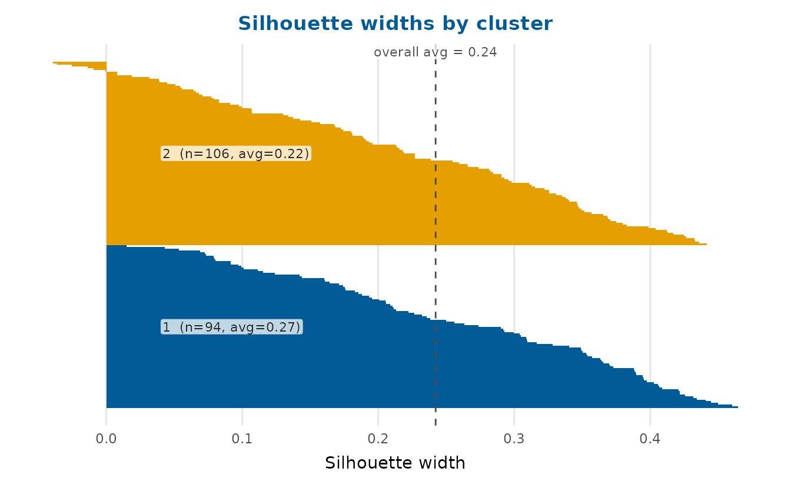
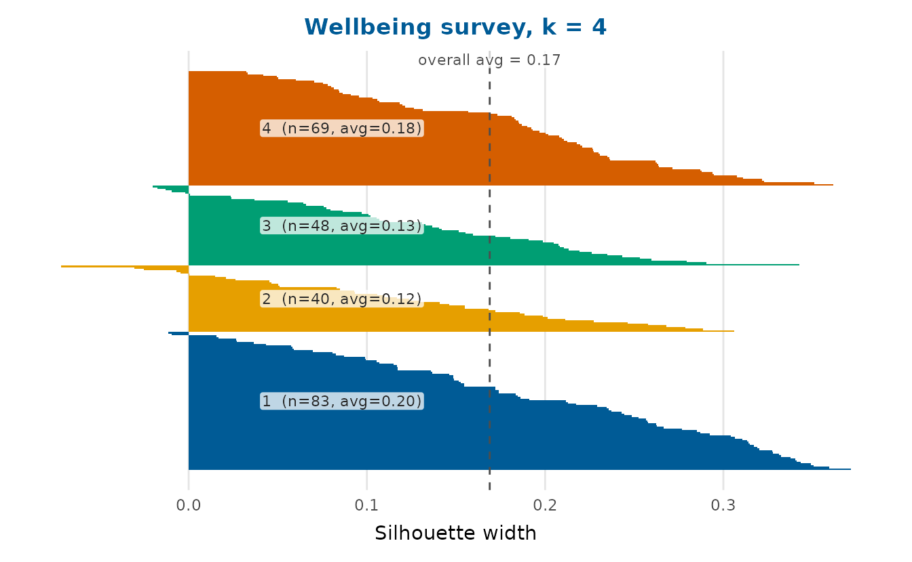
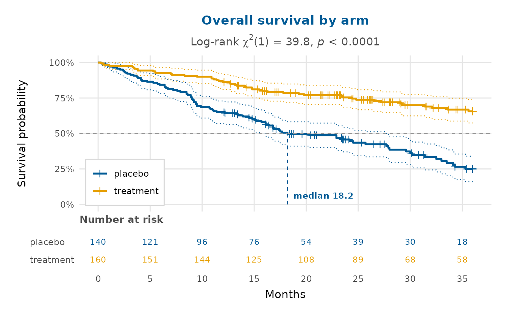

# Multivariate analysis and survival

Beyond regression, depictr covers three staples of applied data
analysis: principal component analysis, clustering (with quality
diagnostics) and survival curves.

## Principal component analysis

[`pca_plot()`](https://pablobernabeu.github.io/depictr/reference/pca_plot.md)
runs a PCA on the numeric columns of a data frame and draws a biplot:
the observations projected onto two components, with the variable
loadings as arrows.
[`scree_plot()`](https://pablobernabeu.github.io/depictr/reference/scree_plot.md)
shows how much variance each component explains.

``` r

num <- c("rainfall", "fertiliser", "soil_ph", "yield")
pca_plot(crop_yield, cols = num, group = "treatment",
         title = "Crop-yield PCA")
```


``` r

scree_plot(crop_yield, cols = num)
```


Both functions also accept a ready-made
[`prcomp()`](https://rdrr.io/r/stats/prcomp.html) object, so you can
analyse once and plot several views:

``` r

pc <- prcomp(crop_yield[num], scale. = TRUE)
pca_plot(pc, components = c(1, 3))
```


## Clustering

[`cluster_plot()`](https://pablobernabeu.github.io/depictr/reference/cluster_plot.md)
runs k-means and shows the clusters on the first two principal
components (so it works for any number of variables), with convex hulls
and labelled centroids.
[`dendrogram_plot()`](https://pablobernabeu.github.io/depictr/reference/dendrogram_plot.md)
draws a hierarchical-clustering tree and can cut it into `k` groups.

``` r

cluster_plot(crop_yield, cols = num, k = 3, seed = 1,
             title = "Crop-yield clusters")
```


``` r

region_means <- aggregate(
  cbind(stress, sleep_hours, life_satisfaction, age, income) ~ region,
  data = wellbeing_survey, FUN = mean
)
rownames(region_means) <- region_means$region
dendrogram_plot(region_means[-1], k = 2, title = "Regions clustered")
```


## How many clusters? Quality diagnostics

Choosing `k` should not be guesswork.
[`k_diagnostic()`](https://pablobernabeu.github.io/depictr/reference/k_diagnostic.md)
evaluates a cluster-quality criterion across a range of `k` and suggests
a value, using the average silhouette width (the default, after
Rousseeuw, 1987), the within-sum-of-squares elbow or the gap statistic
(Tibshirani, Walther & Hastie, 2001). See
[`?k_diagnostic`](https://pablobernabeu.github.io/depictr/reference/k_diagnostic.md)
for the references.

``` r

kd <- k_diagnostic(crop_yield, k_range = 2:6, cols = num,
                   method = "silhouette")
kd  # the diagnostic curve, with the suggested k marked
```


The suggested `k` and the underlying table are attached as attributes:

``` r

attr(kd, "suggested")
#> [1] 2
knitr::kable(attr(kd, "k_table"), digits = 3)
```

|   k | avg_silhouette |
|----:|---------------:|
|   2 |          0.242 |
|   3 |          0.240 |
|   4 |          0.220 |
|   5 |          0.227 |
|   6 |          0.213 |

[`silhouette_plot()`](https://pablobernabeu.github.io/depictr/reference/silhouette_plot.md)
then shows the quality of an actual clustering, one bar per observation
grouped by cluster, with the average silhouette width per cluster and
overall (the dashed line). Wide positive bars are well-placed
observations; negative bars may belong to a neighbouring cluster.

``` r

cl <- kmeans(scale(crop_yield[num]), centers = attr(kd, "suggested"),
             nstart = 10)$cluster
silhouette_plot(crop_yield, cl, cols = num,
                title = "Silhouette widths by cluster")
```



The same diagnostics apply to the wellbeing survey’s numeric profile:

``` r

wb_num <- c("age", "income", "stress", "sleep_hours",
            "exercise_days", "life_satisfaction")
wkd <- k_diagnostic(wellbeing_survey, k_range = 2:6, cols = wb_num,
                    method = "wss")
wcl <- kmeans(scale(na.omit(wellbeing_survey[wb_num])),
              centers = attr(wkd, "suggested"), nstart = 10)$cluster
silhouette_plot(na.omit(wellbeing_survey[wb_num]), wcl,
                title = sprintf("Wellbeing survey, k = %d", attr(wkd, "suggested")))
```



## Survival curves

[`survival_plot()`](https://pablobernabeu.github.io/depictr/reference/survival_plot.md)
draws Kaplan-Meier curves ([Kaplan & Meier, 1958](#ref-kaplan1958)) with
stepwise confidence limits from Greenwood’s formula ([Greenwood,
1926](#ref-greenwood1926)) and censoring marks. The estimate is computed
in base R, so no modelling package is needed; you can pass follow-up
times and an event indicator directly, a data frame, or a
[`survival::survfit`](https://rdrr.io/pkg/survival/man/survfit.html)
object.

The `clinical_trial` dataset has two arms with a real survival
difference (the treatment arm has a lower hazard), so the curves
separate. Turning on the three publication annotations gives a
survminer-style figure: a number-at-risk table beneath the curves,
dashed guides to each arm’s median survival and the log-rank test of the
difference as a subtitle. A survival curve is monotone-decreasing, so
its bottom-left corner is always empty; `legend_inside = TRUE` puts the
group legend there.

``` r

survival_plot(
  clinical_trial$time, clinical_trial$event, group = clinical_trial$arm,
  risk_table = TRUE, median_line = TRUE, logrank = TRUE, legend_inside = TRUE,
  x_lab = "Months", title = "Overall survival by arm"
)
```



The log-rank p-value is tiny and the median survival is clearly longer
in the treatment arm. Because its event times are longer, that arm is
more often right-censored at the 36-month study end, visible as the
denser run of censoring marks.

## References

Greenwood, M. (1926). *The natural duration of cancer* (Vol. 33, pp.
1–26). His Majesty’s Stationery Office.

Kaplan, E. L., & Meier, P. (1958). Nonparametric estimation from
incomplete observations. *Journal of the American Statistical
Association*, *53*(282), 457–481.
<https://doi.org/10.1080/01621459.1958.10501452>
