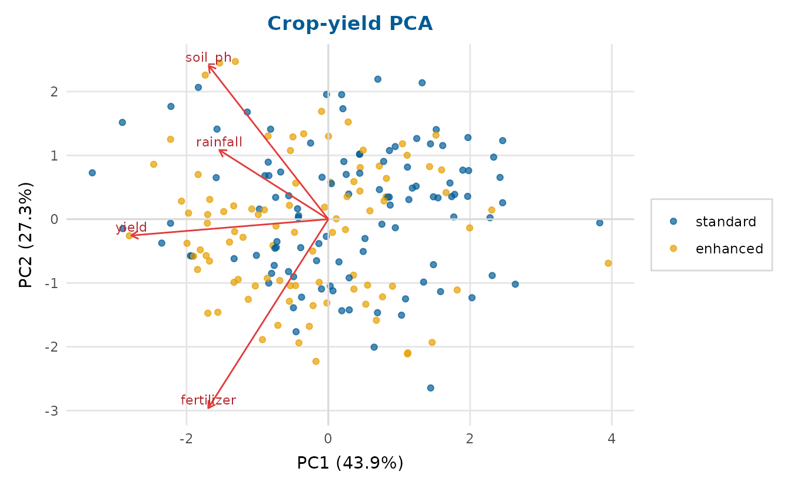
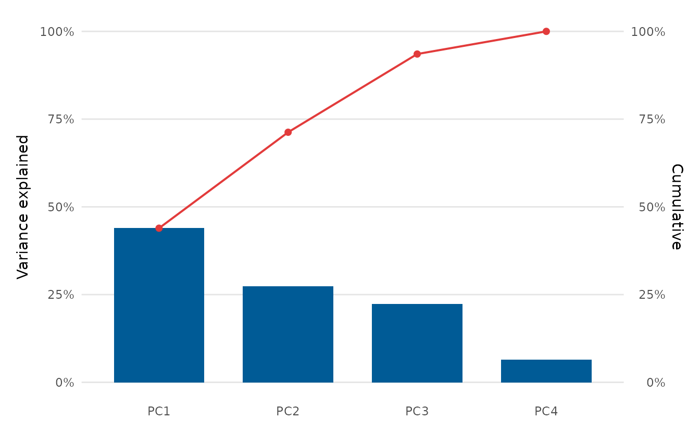
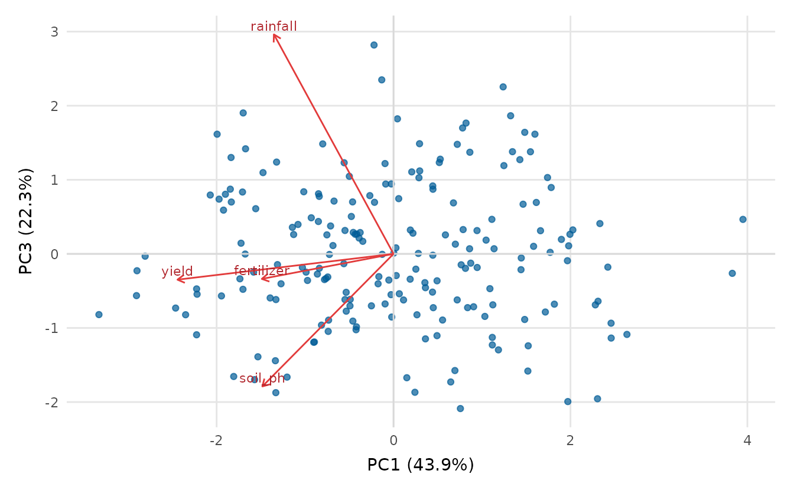
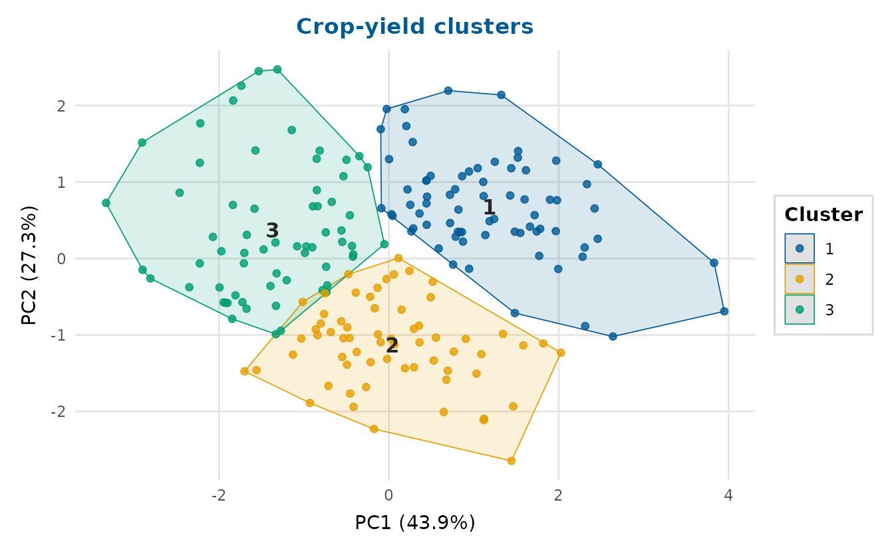
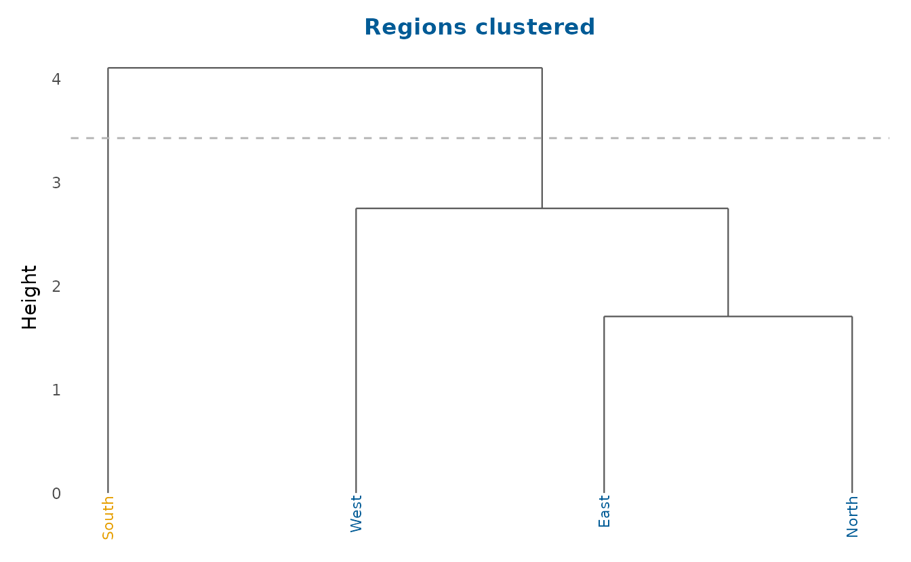
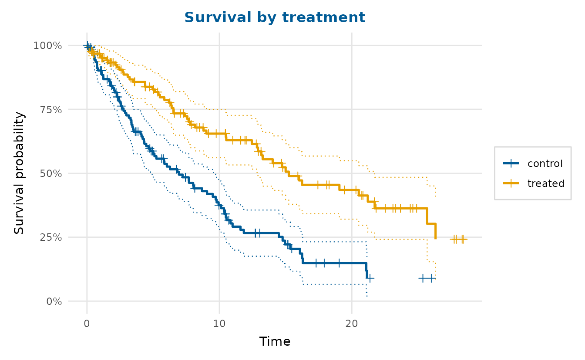

# Multivariate analysis and survival

Beyond regression, depictr covers two staples of applied data analysis:
principal component analysis and survival curves.

## Principal component analysis

[`pca_plot()`](https://pablobernabeu.github.io/depictr/reference/pca_plot.md)
runs a PCA on the numeric columns of a data frame and draws a biplot:
the observations projected onto two components, with the variable
loadings as arrows.
[`scree_plot()`](https://pablobernabeu.github.io/depictr/reference/scree_plot.md)
shows how much variance each component explains.

``` r

num <- c("rainfall", "fertilizer", "soil_ph", "yield")
pca_plot(crop_yield, cols = num, group = "treatment",
         title = "Crop-yield PCA")
```



``` r

scree_plot(crop_yield, cols = num)
```



Both functions also accept a ready-made
[`prcomp()`](https://rdrr.io/r/stats/prcomp.html) object, so you can
analyse once and plot several views:

``` r

pc <- prcomp(crop_yield[num], scale. = TRUE)
pca_plot(pc, components = c(1, 3))
```



## Clustering

[`cluster_plot()`](https://pablobernabeu.github.io/depictr/reference/cluster_plot.md)
runs k-means and shows the clusters on the first two principal
components (so it works for any number of variables), with convex hulls
and labelled centroids.
[`dendrogram_plot()`](https://pablobernabeu.github.io/depictr/reference/dendrogram_plot.md)
draws a hierarchical-clustering tree and can cut it into `k` groups.

``` r

cluster_plot(crop_yield, cols = num, k = 3, title = "Crop-yield clusters")
```



``` r

region_means <- aggregate(
  cbind(stress, sleep_hours, life_satisfaction, age, income) ~ region,
  data = wellbeing_survey, FUN = mean
)
rownames(region_means) <- region_means$region
dendrogram_plot(region_means[-1], k = 2, title = "Regions clustered")
```



## Survival curves

[`survival_plot()`](https://pablobernabeu.github.io/depictr/reference/survival_plot.md)
draws Kaplan-Meier curves ([Kaplan & Meier, 1958](#ref-kaplan1958)) with
stepwise confidence limits from Greenwood’s formula ([Greenwood,
1926](#ref-greenwood1926)) and censoring marks. The estimate is computed
in base R, so no modelling package is needed; you can pass follow-up
times and an event indicator directly, a data frame, or a
[`survival::survfit`](https://rdrr.io/pkg/survival/man/survfit.html)
object.

``` r

set.seed(1)
n <- 250
group <- sample(c("control", "treated"), n, replace = TRUE)
event_time <- rexp(n, rate = ifelse(group == "treated", 0.05, 0.1))
censor_time <- runif(n, 0, 30)
observed <- pmin(event_time, censor_time)
event <- as.integer(event_time <= censor_time)

survival_plot(observed, event, group = group,
              title = "Survival by treatment")
```



## References

Greenwood, M. (1926). *The natural duration of cancer* (Vol. 33, pp.
1–26). His Majesty’s Stationery Office.

Kaplan, E. L., & Meier, P. (1958). Nonparametric estimation from
incomplete observations. *Journal of the American Statistical
Association*, *53*(282), 457–481.
<https://doi.org/10.1080/01621459.1958.10501452>
