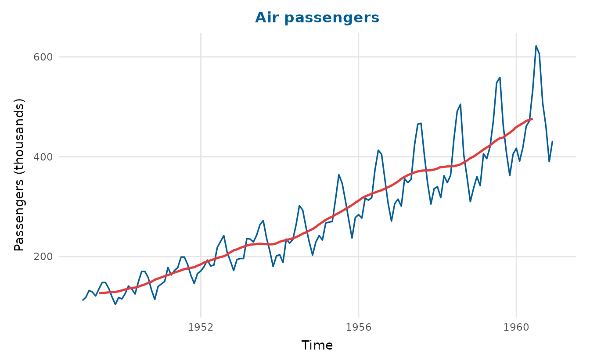
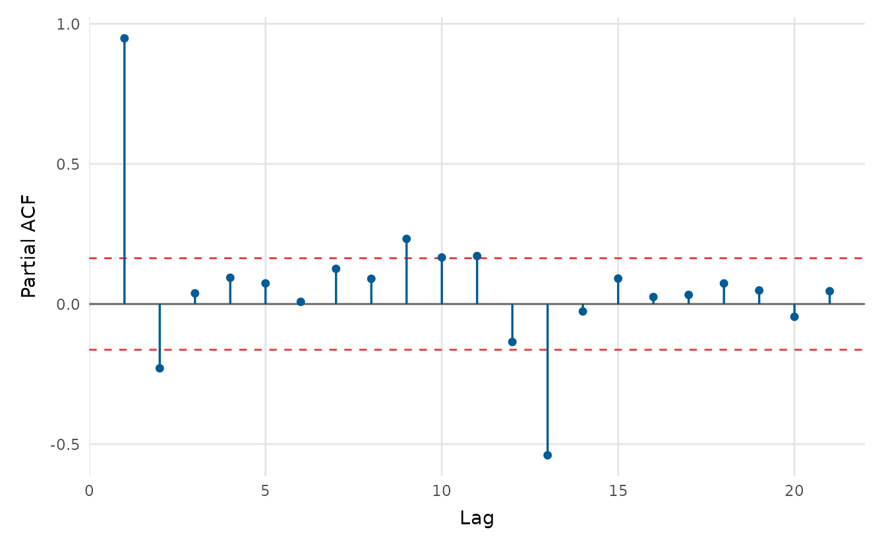
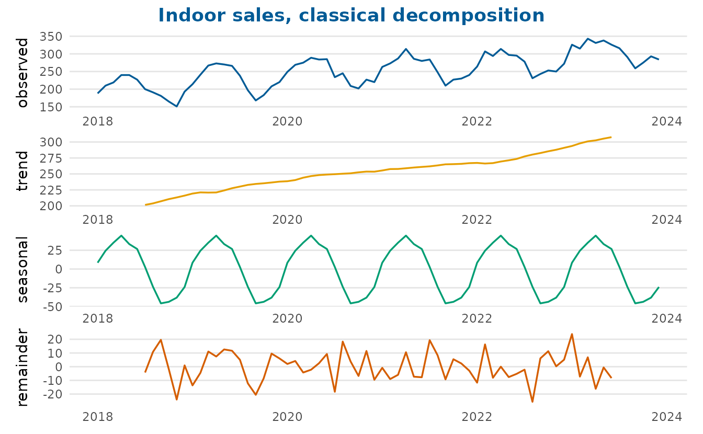
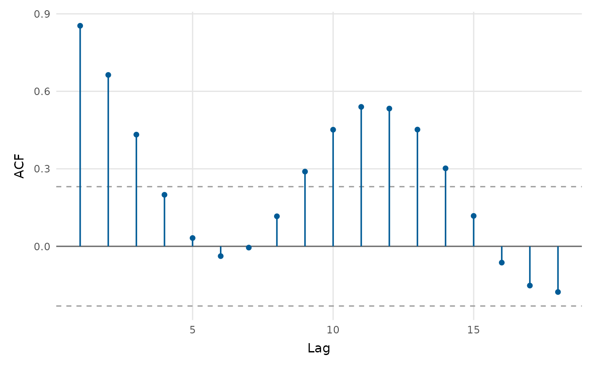
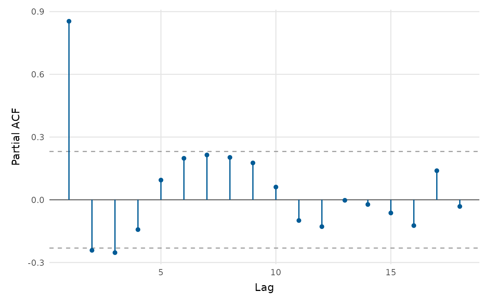
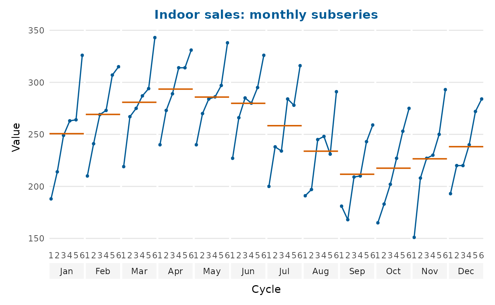
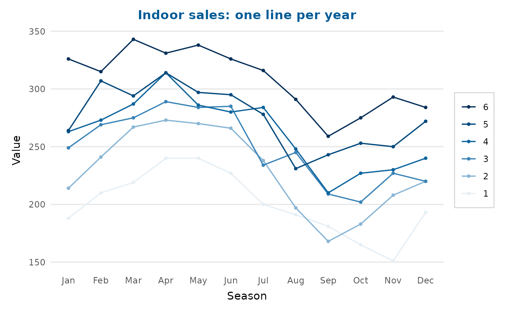
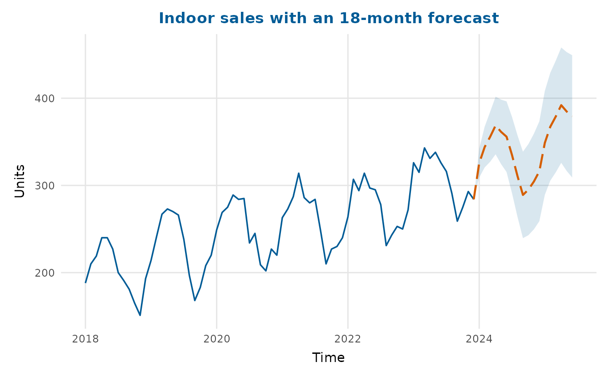

# Time series

depictr provides a small, consistent set of time-series plots. The
examples use the bundled `monthly_sales` dataset: two product lines
(`indoor` and `outdoor`), each with six years of monthly observations
carrying a trend, a twelve-month seasonal cycle and noise.

## Plotting one or several series

[`timeseries_plot()`](https://pablobernabeu.github.io/depictr/reference/timeseries_plot.md)
accepts a `ts` object, a numeric vector, or a data frame with time,
value and (optionally) group columns. Passing the long-form data frame
with a grouping column draws both series at once, each in its own
colour; a moving-average overlay is one argument away.

``` r

timeseries_plot(monthly_sales, time = date, value = sales, group = series,
                rolling = 12, title = "Monthly sales by product line",
                y_lab = "Units")
```



For the single-series views (decomposition, autocorrelation, the
seasonal plot and forecasting) we extract one line as a monthly `ts`
object of frequency 12.

``` r

indoor <- subset(monthly_sales, series == "indoor")
indoor <- indoor[order(indoor$date), ]
indoor_ts <- ts(indoor$sales, start = c(2018, 1), frequency = 12)
```

## Decomposition

[`decompose_plot()`](https://pablobernabeu.github.io/depictr/reference/decompose_plot.md)
separates a seasonal series into trend, seasonal and remainder
components. Use `method = "stl"` (the default, loess-based) or
`method = "classical"`. Setting `confidence = TRUE` shades a band around
the smoothed trend, from the spread of the remainder, so the scale of
the unexplained variation is visible rather than implied by the line
alone.

``` r

decompose_plot(indoor_ts, confidence = TRUE, title = "Indoor sales, decomposed")
```



Classical decomposition instead holds the seasonal component fixed
across the whole series, where STL lets it evolve from year to year.

``` r

decompose_plot(indoor_ts, method = "classical",
               title = "Indoor sales, classical decomposition")
```



## Autocorrelation

[`acf_plot()`](https://pablobernabeu.github.io/depictr/reference/acf_plot.md)
draws the autocorrelation (or, with `type = "partial"`, the partial
autocorrelation) function, with approximate significance bounds. The
spikes at multiples of twelve are the annual seasonality.

``` r

acf_plot(indoor_ts)
```



``` r

acf_plot(indoor_ts, type = "partial")
```



## The seasonal pattern up close

[`seasonal_plot()`](https://pablobernabeu.github.io/depictr/reference/seasonal_plot.md)
draws a seasonal-subseries (cycle) plot: one small panel per month, with
the value traced across successive years and a reference line at each
month’s mean. This shows the seasonal shape (differences *between*
panels) and the year-on-year trend within each month (the slope *inside*
each panel) at the same time, something a single overlaid line cannot
do.

``` r

seasonal_plot(indoor_ts, title = "Indoor sales: monthly subseries")
```



With `style = "season"` every year becomes its own line over the months
on a shared axis, which is handy for spotting an unusual year.

``` r

seasonal_plot(indoor_ts, style = "season",
              title = "Indoor sales: one line per year")
```



## Forecasting

[`ts_forecast()`](https://pablobernabeu.github.io/depictr/reference/ts_forecast.md)
is a lightweight, dependency-free forecaster: it decomposes the series
with STL, extrapolates the recent trend, carries the seasonal pattern
forward, and returns point forecasts with prediction intervals that
widen with the horizon.

``` r

fc <- ts_forecast(indoor_ts, h = 18, level = 0.9)
head(fc)
#>       time      fit      lwr      upr
#> 1 2024.000 325.4647 308.9359 341.9935
#> 2 2024.083 344.0097 320.6345 367.3850
#> 3 2024.167 355.7215 327.0927 384.3502
#> 4 2024.250 368.7429 335.6853 401.8005
#> 5 2024.333 361.4311 324.4716 398.3906
#> 6 2024.417 355.8928 315.4057 396.3799
```

Passing an integer horizon straight to
[`timeseries_plot()`](https://pablobernabeu.github.io/depictr/reference/timeseries_plot.md)
overlays that forecast on the history: the point forecast continues the
line and the shaded ribbon shows the (growing) 90% prediction interval.

``` r

timeseries_plot(indoor_ts, forecast = 18, level = 0.9,
                title = "Indoor sales with an 18-month forecast",
                y_lab = "Units")
```



For a fully specified statistical model, fit it yourself (for example
with
[`forecast::forecast()`](https://generics.r-lib.org/reference/forecast.html))
and pass the resulting `time`/`fit`/`lwr`/`upr` columns to
`timeseries_plot(forecast = )` as a data frame.
