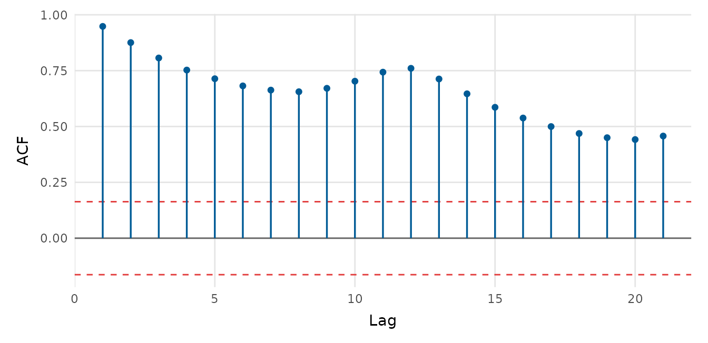

# Time series

depictr provides a small, consistent set of time-series plots. The
examples use `AirPassengers`, a classic monthly series that ships with
base R.

## Plotting a series

[`timeseries_plot()`](https://pablobernabeu.github.io/depictr/reference/timeseries_plot.md)
accepts a `ts` object, a numeric vector, or a data frame with time,
value and (optionally) group columns. A moving-average overlay is one
argument away.

``` r

timeseries_plot(AirPassengers, rolling = 12,
                title = "Air passengers", y_lab = "Passengers (thousands)")
```


## Autocorrelation

[`acf_plot()`](https://pablobernabeu.github.io/depictr/reference/acf_plot.md)
draws the autocorrelation (or, with `type = "partial"`, the partial
autocorrelation) function, with approximate significance bounds.

``` r

acf_plot(AirPassengers)
```



``` r

acf_plot(AirPassengers, type = "partial")
```


## Decomposition

[`decompose_plot()`](https://pablobernabeu.github.io/depictr/reference/decompose_plot.md)
separates a seasonal series into trend, seasonal and remainder
components. Use `method = "stl"` (the default, loess-based) or
`method = "classical"`.

``` r

decompose_plot(AirPassengers, title = "Air passengers, decomposed")
```


